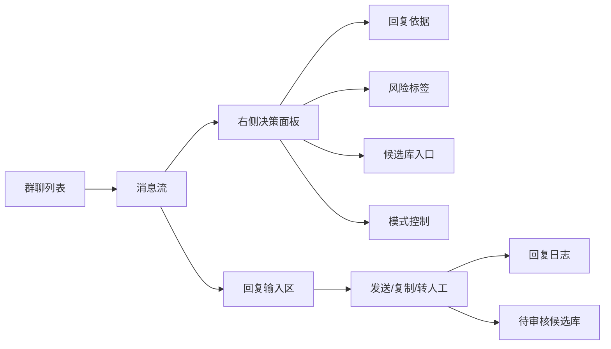
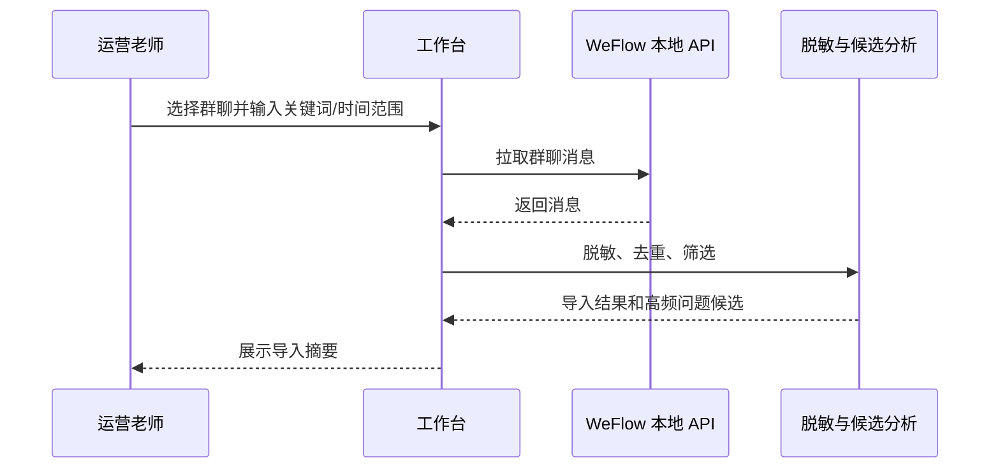
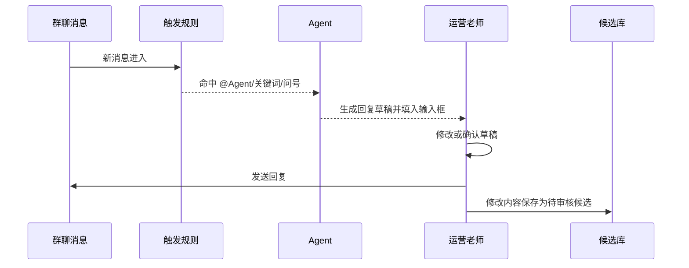
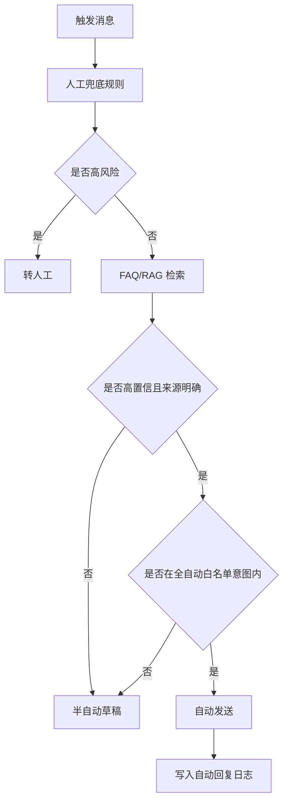

# PC 端群聊答疑运营工作台产品交互方案

## 目标

建设一个面向夏令营运营老师的 PC 端客服运营工作台。界面参考微信的熟悉布局，但产品目标不是替代微信客户端，而是集中处理群聊导入、监听触发、回复草稿、人工确认、自动回复、知识沉淀和风险追踪。

## 目标用户

- 夏令营运营老师：负责群内常见问题答疑、通知同步、人工确认和知识库维护。
- 课程助教：处理技术作业、课程安排、环境配置等需要专业判断的问题。
- 项目负责人：查看自动回复质量、未覆盖问题和全自动模式风险。

## 设计原则

1. **半自动优先**：先让系统帮人减少重复操作，再逐步开放全自动。
2. **来源可见**：每条草稿都要展示来自 FAQ、RAG 资料还是本地候选。
3. **风险前置**：个人状态、投诉安全、作业答案等问题先拦截，再生成回复。
4. **修改不直入库**：人工修改后的内容进入待审核候选库，不直接覆盖正式知识库。
5. **像微信，但更像工作台**：保留聊天流直觉，同时增加右侧运营决策面板。

## 信息架构



## 主界面布局

### 左侧：群聊与监听列表

展示内容：

- 群聊名称。
- 监听状态：未连接、导入中、监听中、暂停、异常。
- 未处理问题数。
- 全自动是否开启。
- 最近一条触发消息时间。

主要操作：

- 选择群聊。
- 导入历史聊天记录。
- 开始/暂停监听。
- 配置关键词。
- 切换半自动/全自动模式。

### 中间：微信风格消息流

展示内容：

- 学生消息。
- 被触发的疑似问题。
- Agent 生成的草稿气泡。
- 已发送回复。
- 转人工、待补充、已忽略等系统状态。

消息状态：

| 状态 | 含义 | 默认展示 |
| --- | --- | --- |
| 未触发 | 普通闲聊或无关消息 | 灰色弱展示 |
| 待处理 | 命中 `@Agent`、关键词或问号 | 高亮展示 |
| 已生成草稿 | Agent 已产出建议回复 | 显示草稿卡片 |
| 待人工确认 | 半自动模式等待运营处理 | 显示操作按钮 |
| 已自动回复 | 全自动模式已发送 | 显示来源和日志标识 |
| 已转人工 | 需要运营/助教/负责人处理 | 显示转人工原因 |
| 待补充知识库 | 当前资料无法明确回答 | 显示候选入口 |

### 右侧：运营决策面板

按当前选中消息展示：

- 识别结果：触发原因、意图、风险类型。
- 回复建议：草稿正文、推荐动作、置信度。
- 来源依据：FAQ 条目、RAG 文档标题/章节、更新时间。
- 风险检查：是否涉及个人状态、安全投诉、作业答案、过期信息。
- 候选处理：保存为 FAQ 候选、RAG 资料候选、风格样例或忽略。
- 模式建议：是否允许全自动、是否建议人工确认。

### 底部：回复输入区

半自动模式下：

- 自动填入 Agent 草稿。
- 运营可以编辑。
- 点击“发送”后写入回复日志。
- 如果内容被修改，弹出“保存为更优回复候选”的轻量提示。

全自动模式下：

- 输入区显示最近一次自动回复内容。
- 自动回复仍进入日志。
- 运营可以撤销后续自动、暂停监听或把该问题加入禁答规则。

## 核心流程

### 流程 1：群聊导入



导入结果不直接进入事实 RAG，只进入：

- 高频问题发现。
- 风格样例分析。
- 待审核 FAQ 候选。

### 流程 2：半自动回复



### 流程 3：受控全自动回复



## 触发规则

只处理三类消息：

1. 被 `@Agent` 的消息。
2. 命中关键词的消息，例如报名、住宿、交通、作业、面试、通知、报到、GPU、算子。
3. 含问号且与夏令营相关的消息。

默认不处理：

- 普通闲聊。
- 表情、图片、语音等无法明确识别的消息。
- 群成员之间已经有人回答且无需补充的消息。

## 回复模式

### 半自动模式

默认模式，适合大多数群聊：

- 系统生成草稿。
- 运营确认或修改。
- 修改后进入待审核候选库。
- 不会绕过人工直接发送不确定内容。

### 全自动模式

只对明确答案开放：

- 命中 FAQ 或 RAG。
- 置信度达到高阈值。
- 来源可追溯。
- 命中全自动白名单意图。
- 未触发任何风险规则。

全自动仍需支持：

- 一键暂停。
- 自动回复日志。
- 禁答规则。
- 每群每日自动回复上限。

## 待审核候选库

候选来源：

- 人工修改后的草稿。
- 未命中的学生问题。
- 历史群聊中的高频问题。
- 运营手动标记的问题。

候选类型：

| 类型 | 用途 |
| --- | --- |
| FAQ 候选 | 结构化高频问答 |
| RAG 资料候选 | 需要补充到正式资料的段落 |
| 风格样例 | 学习运营老师表达方式 |
| 禁答规则 | 需要稳定转人工的问题 |

## 低保真界面草图

```text
┌────────────────┬────────────────────────────────────┬──────────────────────────┐
│ 群聊列表        │ 消息流                              │ 决策面板                 │
│                │                                    │                          │
│ ● 咨询群        │ 学生A：报名入口在哪？                │ 触发：关键词 + 问号       │
│   监听中 12     │                                    │ 意图：registration.link   │
│                │ Agent 草稿：                         │ 置信度：0.96             │
│ ○ 入营群        │ 同学你好，当前报名入口为...           │ 来源：FAQ / 招募文章      │
│   暂停 3        │                                    │ 风险：低                 │
│                │ 运营：已发送                         │                          │
│ ○ 技术答疑群    │                                    │ [保存 FAQ 候选]           │
│   异常 0        │                                    │ [转人工] [忽略]           │
├────────────────┴────────────────────────────────────┴──────────────────────────┤
│ 回复输入框：同学你好，当前报名入口为...                         [发送] [复制] │
└───────────────────────────────────────────────────────────────────────────────┘
```

## 第一版启动方式

双击 `启动夏令营Agent.cmd` 后默认启动本地服务，并自动打开浏览器版 PC 端群聊答疑运营工作台。

Tkinter 版工作台仍可通过 `python -m summer_camp_agent.workbench_gui` 启动；如果本机 Tcl/Tk 运行时不完整，使用默认浏览器版。旧的单轮对话验证能力仍可通过 `python -m summer_camp_agent.gui` 启动。

## 当前 MVP 可演示能力

- 启动后自动载入内置演示消息，覆盖可答复、转人工、待补充和未触发消息。
- 支持从 `examples/workbench_demo_chat.jsonl` 或 WeFlow 导出的脱敏 JSONL 导入聊天记录。
- 消息流按处理状态展示：待审核、转人工、待补充、未触发。
- 点击消息后，右侧决策面板展示触发原因、关键词、建议动作、意图、来源、置信度和回复草稿。
- 半自动模式会把草稿填入底部输入框，运营可以修改后发送。
- 修改后发送会把更优回复写入待审核候选库；仅点击“保存候选”不会写入发送日志。
- 所有发送动作只记录在本地日志中，不会真实向普通微信或企业微信发消息。

## 验收标准

1. 运营老师可以选择一个群聊并看到消息流。
2. 工作台只高亮 `@Agent`、关键词、问号相关消息。
3. 半自动模式会把 Agent 回复填入输入框。
4. 人工修改后的回复不会直接覆盖正式知识库，而是进入待审核候选库。
5. 全自动模式只对高置信低风险问题生效。
6. 每条自动/半自动回复都有来源、置信度和操作日志。
7. 遇到个人状态、投诉安全、作业答案等问题时稳定转人工。
