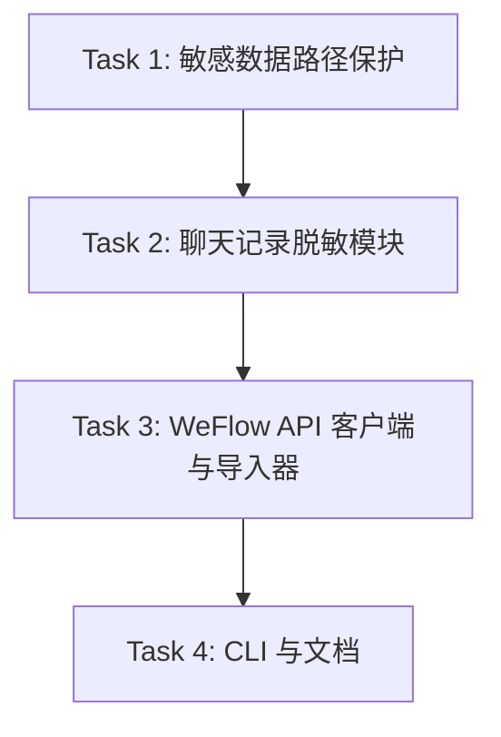

# WeFlow 本地 API 聊天记录导入 Implementation Plan

> **For agentic workers:** REQUIRED SUB-SKILL: Use superpowers:subagent-driven-development (recommended) or superpowers:executing-plans to implement this plan task-by-task. Steps use checkbox (`- [ ]`) syntax for tracking.

**Goal:** 增加一个安全边界清晰的 WeFlow 本地 API 导入器，把指定微信群聊天记录导出为本项目可消费的脱敏 JSONL。

**Architecture:** 使用标准库实现，不新增第三方依赖。`weflow_import.py` 负责本地 HTTP API 请求、会话选择、分页拉取和导出编排；`chat_log_sanitizer.py` 负责关键词过滤、脱敏、哈希、成员别名和去重；CLI 只负责参数解析、环境变量读取和中文结果输出。

**Tech Stack:** Python 3 标准库、`argparse`、`urllib.request`、`json`、`dataclasses`、`unittest`、现有 `summer_camp_agent.cli` 命令入口。

---

## 文件结构

- 新增 `summer_camp_agent/chat_log_sanitizer.py`：纯函数和小型状态类，负责脱敏、关键词命中、哈希、成员别名、JSONL 行生成。
- 新增 `summer_camp_agent/weflow_import.py`：WeFlow API 客户端、导入配置、导入摘要、异常类型和导入编排函数。
- 修改 `summer_camp_agent/cli.py`：增加 `import-weflow` 子命令。
- 修改 `.gitignore`：忽略 `imports/chat_logs/`、`data/rag/index/`、`data/weflow_role_map.json`、`data/style_profile.json`。
- 修改 `docs/README.md`：增加 WeFlow 导入命令、Token 环境变量和安全边界说明。
- 新增 `tests/test_chat_log_sanitizer.py`：覆盖脱敏、关键词、别名、去重。
- 新增 `tests/test_weflow_import.py`：覆盖本地 URL 校验、鉴权 Header、会话匹配、分页、JSONL 输出。
- 修改 `tests/test_cli.py`：覆盖缺失 `WEFLOW_API_TOKEN` 时的中文错误。

## 任务依赖图



### Task 1: 敏感数据路径保护

**Files:**
- Modify: `.gitignore`

- [ ] **Step 1: 写入忽略规则**

在 `.gitignore` 末尾追加：

```gitignore

# 微信/WeFlow 导入数据与派生索引，默认只保留在本地
imports/chat_logs/
data/rag/index/
data/weflow_role_map.json
data/style_profile.json
```

- [ ] **Step 2: 检查忽略规则生效**

Run:

```powershell
git -c safe.directory='D:/workspace/codex/自动回复agent' check-ignore imports/chat_logs/example.jsonl data/rag/index/example data/weflow_role_map.json data/style_profile.json
```

Expected:

```text
imports/chat_logs/example.jsonl
data/rag/index/example
data/weflow_role_map.json
data/style_profile.json
```

- [ ] **Step 3: 暂存并提交**

```powershell
git -c safe.directory='D:/workspace/codex/自动回复agent' add .gitignore
git -c safe.directory='D:/workspace/codex/自动回复agent' commit -m "chore: ignore imported chat data"
```

### Task 2: 聊天记录脱敏模块

**Files:**
- Create: `summer_camp_agent/chat_log_sanitizer.py`
- Test: `tests/test_chat_log_sanitizer.py`

- [ ] **Step 1: 写失败测试**

新增 `tests/test_chat_log_sanitizer.py`：

```python
import unittest

from summer_camp_agent.chat_log_sanitizer import (
    AliasRegistry,
    SanitizedMessage,
    build_sanitized_message,
    content_matches_keywords,
    hash_identifier,
    sanitize_content,
)


class ChatLogSanitizerTest(unittest.TestCase):
    def test_sanitize_content_masks_common_personal_info(self):
        content = "手机号 13800138000，邮箱 a@test.com，身份证 11010119900307893X，链接 https://example.com/a?token=abc"

        sanitized = sanitize_content(content)

        self.assertIn("[手机号]", sanitized)
        self.assertIn("[邮箱]", sanitized)
        self.assertIn("[身份证]", sanitized)
        self.assertIn("https://example.com", sanitized)
        self.assertNotIn("13800138000", sanitized)
        self.assertNotIn("token=abc", sanitized)

    def test_keyword_matching_returns_unique_hits(self):
        hits = content_matches_keywords("报名入口在哪里，怎么报名？", ["报名", "住宿", "报名"])

        self.assertEqual(hits, ["报名"])

    def test_alias_registry_is_stable_per_sender(self):
        registry = AliasRegistry()

        self.assertEqual(registry.alias_for("wxid_a"), "成员001")
        self.assertEqual(registry.alias_for("wxid_b"), "成员002")
        self.assertEqual(registry.alias_for("wxid_a"), "成员001")

    def test_hash_identifier_does_not_return_raw_value(self):
        digest = hash_identifier("wxid_secret")

        self.assertTrue(digest.startswith("sha256:"))
        self.assertNotIn("wxid_secret", digest)

    def test_build_sanitized_message_filters_unmatched_keywords(self):
        registry = AliasRegistry()

        message = build_sanitized_message(
            source="weflow_api",
            group_name="测试群",
            group_id="room@chatroom",
            message_time="2026-06-20 10:21:00",
            sender_id="wxid_a",
            content="今天午饭吃什么？",
            keywords=["报名"],
            platform_message_id="123",
            raw_type=0,
            alias_registry=registry,
        )

        self.assertIsNone(message)

    def test_build_sanitized_message_outputs_safe_fields(self):
        registry = AliasRegistry()

        message = build_sanitized_message(
            source="weflow_api",
            group_name="测试群",
            group_id="room@chatroom",
            message_time="2026-06-20 10:21:00",
            sender_id="wxid_a",
            content="报名入口发一下，手机号 13800138000",
            keywords=["报名"],
            platform_message_id="123",
            raw_type=0,
            alias_registry=registry,
        )

        self.assertIsInstance(message, SanitizedMessage)
        self.assertEqual(message.sender_alias, "成员001")
        self.assertEqual(message.matched_keywords, ["报名"])
        self.assertIn("[手机号]", message.content)
        self.assertNotIn("wxid_a", message.to_dict().values())


if __name__ == "__main__":
    unittest.main()
```

- [ ] **Step 2: 运行测试确认失败**

Run:

```powershell
python -B -m unittest tests.test_chat_log_sanitizer
```

Expected:

```text
ModuleNotFoundError: No module named 'summer_camp_agent.chat_log_sanitizer'
```

- [ ] **Step 3: 实现脱敏模块**

新增 `summer_camp_agent/chat_log_sanitizer.py`：

```python
from __future__ import annotations

import hashlib
import re
from dataclasses import asdict, dataclass
from urllib.parse import urlsplit


PHONE_RE = re.compile(r"(?<!\d)1[3-9]\d{9}(?!\d)")
EMAIL_RE = re.compile(r"(?<![\w.+-])[\w.+-]+@[\w-]+(?:\.[\w-]+)+(?![\w.-])")
ID_CARD_RE = re.compile(r"(?<!\d)\d{17}[\dXx](?!\d)")
BANK_CARD_RE = re.compile(r"(?<!\d)(?:\d[ -]?){13,19}(?!\d)")
URL_RE = re.compile(r"https?://[^\s，。；、)）]+")
MEDIA_ONLY_RE = re.compile(r"^\[[^\]]+\]$")


@dataclass(frozen=True)
class SanitizedMessage:
    source: str
    group_name: str
    group_id_hash: str
    message_time: str
    sender_alias: str
    sender_hash: str
    sender_role: str
    content: str
    matched_keywords: list[str]
    platform_message_id_hash: str
    raw_type: int | str

    def to_dict(self) -> dict[str, object]:
        return asdict(self)


class AliasRegistry:
    def __init__(self) -> None:
        self._aliases: dict[str, str] = {}

    def alias_for(self, sender_id: str) -> str:
        key = sender_id or "unknown"
        if key not in self._aliases:
            self._aliases[key] = f"成员{len(self._aliases) + 1:03d}"
        return self._aliases[key]


def hash_identifier(value: str) -> str:
    normalized = value or "unknown"
    digest = hashlib.sha256(normalized.encode("utf-8")).hexdigest()
    return f"sha256:{digest}"


def sanitize_content(content: str, max_chars: int = 2000) -> str:
    sanitized = str(content or "").strip()
    sanitized = EMAIL_RE.sub("[邮箱]", sanitized)
    sanitized = ID_CARD_RE.sub("[身份证]", sanitized)
    sanitized = PHONE_RE.sub("[手机号]", sanitized)
    sanitized = BANK_CARD_RE.sub("[银行卡号]", sanitized)
    sanitized = URL_RE.sub(_sanitize_url, sanitized)
    if len(sanitized) > max_chars:
        sanitized = sanitized[:max_chars].rstrip() + "..."
    return sanitized


def content_matches_keywords(content: str, keywords: list[str]) -> list[str]:
    if not keywords:
        return []
    hits: list[str] = []
    for keyword in keywords:
        normalized = keyword.strip()
        if normalized and normalized in content and normalized not in hits:
            hits.append(normalized)
    return hits


def build_sanitized_message(
    *,
    source: str,
    group_name: str,
    group_id: str,
    message_time: str,
    sender_id: str,
    content: str,
    keywords: list[str],
    platform_message_id: str,
    raw_type: int | str,
    alias_registry: AliasRegistry,
    include_media: bool = False,
) -> SanitizedMessage | None:
    sanitized_content = sanitize_content(content)
    if not sanitized_content:
        return None
    if MEDIA_ONLY_RE.match(sanitized_content) and not include_media:
        return None
    matched = content_matches_keywords(sanitized_content, keywords)
    if keywords and not matched:
        return None
    return SanitizedMessage(
        source=source,
        group_name=group_name,
        group_id_hash=hash_identifier(group_id),
        message_time=message_time,
        sender_alias=alias_registry.alias_for(sender_id),
        sender_hash=hash_identifier(sender_id),
        sender_role="unknown",
        content=sanitized_content,
        matched_keywords=matched,
        platform_message_id_hash=hash_identifier(platform_message_id),
        raw_type=raw_type,
    )


def _sanitize_url(match: re.Match[str]) -> str:
    raw = match.group(0)
    parsed = urlsplit(raw)
    if not parsed.scheme or not parsed.netloc:
        return "[链接]"
    return f"{parsed.scheme}://{parsed.netloc}"
```

- [ ] **Step 4: 运行测试确认通过**

Run:

```powershell
python -B -m unittest tests.test_chat_log_sanitizer
```

Expected:

```text
OK
```

- [ ] **Step 5: 提交**

```powershell
git -c safe.directory='D:/workspace/codex/自动回复agent' add summer_camp_agent/chat_log_sanitizer.py tests/test_chat_log_sanitizer.py
git -c safe.directory='D:/workspace/codex/自动回复agent' commit -m "feat: add chat log sanitizer"
```

### Task 3: WeFlow API 客户端与导入器

**Files:**
- Create: `summer_camp_agent/weflow_import.py`
- Test: `tests/test_weflow_import.py`

- [ ] **Step 1: 写失败测试**

新增 `tests/test_weflow_import.py`：

```python
import json
import tempfile
import unittest
from io import BytesIO
from pathlib import Path
from urllib.error import HTTPError, URLError

from summer_camp_agent.weflow_import import (
    WeFlowAuthError,
    WeFlowImportConfig,
    WeFlowImportClient,
    WeFlowImportError,
    WeFlowSessionSelectionRequired,
    import_weflow_chat,
)


class FakeResponse:
    def __init__(self, payload, status=200):
        self.payload = json.dumps(payload).encode("utf-8")
        self.status = status

    def __enter__(self):
        return self

    def __exit__(self, exc_type, exc, traceback):
        return False

    def read(self):
        return self.payload


class FakeUrlOpen:
    def __init__(self, responses):
        self.responses = list(responses)
        self.requests = []

    def __call__(self, request, timeout):
        self.requests.append(request)
        response = self.responses.pop(0)
        if isinstance(response, Exception):
            raise response
        return FakeResponse(response)


class WeFlowImportTest(unittest.TestCase):
    def test_rejects_remote_base_url(self):
        with self.assertRaisesRegex(WeFlowImportError, "只允许连接本机"):
            WeFlowImportClient("https://example.com", "token")

    def test_search_sessions_uses_bearer_token(self):
        opener = FakeUrlOpen([{"sessions": [{"id": "room@chatroom", "name": "测试群", "type": "group"}]}])
        client = WeFlowImportClient("http://127.0.0.1:5031", "secret-token", urlopen=opener)

        sessions = client.search_sessions("测试")

        self.assertEqual(sessions[0].id, "room@chatroom")
        self.assertEqual(opener.requests[0].headers["Authorization"], "Bearer secret-token")

    def test_import_writes_sanitized_jsonl(self):
        with tempfile.TemporaryDirectory() as directory:
            opener = FakeUrlOpen(
                [
                    {"sessions": [{"id": "room@chatroom", "name": "测试群", "type": "group"}]},
                    {
                        "meta": {"name": "测试群", "groupId": "room@chatroom"},
                        "messages": [
                            {
                                "sender": "wxid_a",
                                "timestamp": 1781911260,
                                "type": 0,
                                "content": "报名入口在哪里？手机号 13800138000",
                                "platformMessageId": "msg1",
                            },
                            {
                                "sender": "wxid_b",
                                "timestamp": 1781911320,
                                "type": 0,
                                "content": "午饭吃什么？",
                                "platformMessageId": "msg2",
                            },
                        ],
                        "sync": {"hasMore": False},
                    },
                ]
            )
            client = WeFlowImportClient("http://127.0.0.1:5031", "token", urlopen=opener)
            config = WeFlowImportConfig(
                group_name="测试群",
                keywords=["报名"],
                start="20260601",
                end="20260630",
                output_dir=Path(directory),
            )

            summary = import_weflow_chat(config, client=client, token="token")
            lines = summary.output_path.read_text(encoding="utf-8").splitlines()
            row = json.loads(lines[0])

            self.assertEqual(summary.written_count, 1)
            self.assertEqual(row["sender_alias"], "成员001")
            self.assertIn("[手机号]", row["content"])
            self.assertNotIn("wxid_a", json.dumps(row, ensure_ascii=False))

    def test_multiple_sessions_require_selection(self):
        opener = FakeUrlOpen(
            [
                {
                    "sessions": [
                        {"id": "a@chatroom", "name": "测试群 A", "type": "group"},
                        {"id": "b@chatroom", "name": "测试群 B", "type": "group"},
                    ]
                }
            ]
        )
        client = WeFlowImportClient("http://127.0.0.1:5031", "token", urlopen=opener)

        with self.assertRaises(WeFlowSessionSelectionRequired) as ctx:
            import_weflow_chat(WeFlowImportConfig(group_name="测试群", keywords=[]), client=client, token="token")

        self.assertEqual(len(ctx.exception.sessions), 2)

    def test_auth_error_is_reported_without_token(self):
        response = BytesIO(b'{"error":"unauthorized"}')
        error = HTTPError("http://127.0.0.1", 401, "Unauthorized", {}, response)
        client = WeFlowImportClient("http://127.0.0.1:5031", "token", urlopen=FakeUrlOpen([error]))

        with self.assertRaises(WeFlowAuthError):
            client.search_sessions("测试")

    def test_connection_error_is_reported(self):
        client = WeFlowImportClient("http://127.0.0.1:5031", "token", urlopen=FakeUrlOpen([URLError("refused")]))

        with self.assertRaisesRegex(WeFlowImportError, "无法连接"):
            client.search_sessions("测试")

    def test_pull_messages_falls_back_to_legacy_messages_endpoint(self):
        response = BytesIO(b'{"error":"not found"}')
        not_found = HTTPError("http://127.0.0.1", 404, "Not Found", {}, response)
        opener = FakeUrlOpen(
            [
                not_found,
                {
                    "meta": {"name": "测试群", "groupId": "room@chatroom"},
                    "messages": [],
                    "sync": {"hasMore": False},
                },
            ]
        )
        client = WeFlowImportClient("http://127.0.0.1:5031", "token", urlopen=opener)

        payload = client.pull_messages("room@chatroom", since=1781911260, end=1781997660, limit=5000, offset=0)

        self.assertEqual(payload["messages"], [])
        self.assertIn("/api/v1/messages", opener.requests[1].full_url)
        self.assertIn("talker=room%40chatroom", opener.requests[1].full_url)


if __name__ == "__main__":
    unittest.main()
```

- [ ] **Step 2: 运行测试确认失败**

Run:

```powershell
python -B -m unittest tests.test_weflow_import
```

Expected:

```text
ModuleNotFoundError: No module named 'summer_camp_agent.weflow_import'
```

- [ ] **Step 3: 实现 WeFlow 导入器**

新增 `summer_camp_agent/weflow_import.py`，实现以下接口：

```python
from __future__ import annotations

import json
import os
from dataclasses import dataclass
from datetime import datetime, timedelta
from pathlib import Path
from typing import Any, Callable
from urllib.error import HTTPError, URLError
from urllib.parse import urlencode, urljoin, urlsplit
from urllib.request import Request, urlopen as default_urlopen

from .chat_log_sanitizer import AliasRegistry, build_sanitized_message, hash_identifier


class WeFlowImportError(RuntimeError):
    pass


class WeFlowAuthError(WeFlowImportError):
    pass


class WeFlowHttpError(WeFlowImportError):
    def __init__(self, status_code: int, message: str):
        self.status_code = status_code
        super().__init__(message)


class WeFlowSessionNotFoundError(WeFlowImportError):
    pass


class WeFlowSessionSelectionRequired(WeFlowImportError):
    def __init__(self, sessions: list["WeFlowSession"]):
        self.sessions = sessions
        super().__init__("找到多个匹配群聊，请使用 --session-id 明确指定。")


@dataclass(frozen=True)
class WeFlowSession:
    id: str
    name: str
    type: str
    last_message_at: int = 0
    message_count: int = 0


@dataclass(frozen=True)
class WeFlowImportConfig:
    group_name: str
    keywords: list[str]
    start: str = ""
    end: str = ""
    limit: int = 5000
    output_dir: Path = Path("imports/chat_logs")
    base_url: str = "http://127.0.0.1:5031"
    token_env: str = "WEFLOW_API_TOKEN"
    session_id: str = ""
    include_media: bool = False


@dataclass(frozen=True)
class WeFlowImportSummary:
    output_path: Path
    session_id_hash: str
    group_name: str
    pulled_count: int
    written_count: int
    skipped_count: int


class WeFlowImportClient:
    def __init__(
        self,
        base_url: str,
        token: str,
        *,
        urlopen: Callable[..., Any] = default_urlopen,
        timeout_seconds: int = 10,
    ):
        self.base_url = _validate_local_base_url(base_url)
        self.token = token
        self._urlopen = urlopen
        self.timeout_seconds = timeout_seconds

    def search_sessions(self, keyword: str) -> list[WeFlowSession]:
        payload = self._get_json("/api/v1/sessions", {"format": "chatlab", "keyword": keyword, "limit": 100})
        raw_sessions = payload.get("sessions", [])
        sessions = []
        for raw in raw_sessions:
            session = _session_from_chatlab(raw)
            if session.type == "group":
                sessions.append(session)
        return sessions

    def pull_messages(self, session_id: str, *, since: int | None, end: int | None, limit: int, offset: int) -> dict[str, Any]:
        params: dict[str, object] = {"limit": min(max(limit, 1), 5000), "offset": max(offset, 0)}
        if since is not None:
            params["since"] = since
        if end is not None:
            params["end"] = end
        try:
            return self._get_json(f"/api/v1/sessions/{session_id}/messages", params)
        except WeFlowHttpError as exc:
            if exc.status_code != 404:
                raise
            legacy_params: dict[str, object] = {
                "talker": session_id,
                "limit": params["limit"],
                "offset": params["offset"],
                "chatlab": "1",
            }
            if since is not None:
                legacy_params["start"] = since
            if end is not None:
                legacy_params["end"] = end
            return self._get_json("/api/v1/messages", legacy_params)

    def _get_json(self, path: str, params: dict[str, object]) -> dict[str, Any]:
        query = urlencode(params)
        url = urljoin(self.base_url, path)
        if query:
            url = f"{url}?{query}"
        request = Request(url, headers={"Authorization": f"Bearer {self.token}", "Accept": "application/json"})
        try:
            with self._urlopen(request, timeout=self.timeout_seconds) as response:
                raw = response.read()
        except HTTPError as exc:
            if exc.code in (401, 403):
                raise WeFlowAuthError("WeFlow API 鉴权失败，请检查 WEFLOW_API_TOKEN。") from exc
            raise WeFlowHttpError(exc.code, f"WeFlow API 返回错误: HTTP {exc.code}") from exc
        except URLError as exc:
            raise WeFlowImportError("无法连接 WeFlow API，请确认 WeFlow 已启动并开启 API 服务。") from exc
        try:
            payload = json.loads(raw.decode("utf-8"))
        except (UnicodeDecodeError, json.JSONDecodeError) as exc:
            raise WeFlowImportError("WeFlow API 返回内容不是有效 JSON。") from exc
        if not isinstance(payload, dict):
            raise WeFlowImportError("WeFlow API 返回结构不是 JSON 对象。")
        return payload


def import_weflow_chat(
    config: WeFlowImportConfig,
    *,
    client: WeFlowImportClient | None = None,
    token: str | None = None,
) -> WeFlowImportSummary:
    token_value = token or os.environ.get(config.token_env, "")
    if not token_value:
        raise WeFlowAuthError(f"缺少 {config.token_env}，请先设置 WeFlow API Token 环境变量。")
    active_client = client or WeFlowImportClient(config.base_url, token_value)
    session = _select_session(active_client, config)
    output_path = _build_output_path(config.output_dir, config.group_name, config.start, config.end)
    output_path.parent.mkdir(parents=True, exist_ok=True)
    since = _date_to_timestamp(config.start)
    end = _end_date_to_timestamp(config.end)
    alias_registry = AliasRegistry()
    seen_hashes: set[str] = set()
    pulled_count = 0
    written_count = 0
    offset = 0

    with output_path.open("w", encoding="utf-8") as handle:
        while True:
            payload = active_client.pull_messages(session.id, since=since, end=end, limit=config.limit, offset=offset)
            messages = payload.get("messages", [])
            if not isinstance(messages, list):
                raise WeFlowImportError("WeFlow API messages 字段不是列表。")
            pulled_count += len(messages)
            meta = payload.get("meta", {}) if isinstance(payload.get("meta", {}), dict) else {}
            group_id = str(meta.get("groupId") or session.id)
            for raw in messages:
                if not isinstance(raw, dict):
                    continue
                message = _sanitize_chatlab_message(raw, config, session.name, group_id, alias_registry)
                if message is None:
                    continue
                dedupe_key = message.platform_message_id_hash
                if dedupe_key in seen_hashes:
                    continue
                seen_hashes.add(dedupe_key)
                handle.write(json.dumps(message.to_dict(), ensure_ascii=False) + "\n")
                written_count += 1
            sync = payload.get("sync", {}) if isinstance(payload.get("sync", {}), dict) else {}
            if not sync.get("hasMore"):
                break
            offset = int(sync.get("nextOffset") or offset + len(messages))

    return WeFlowImportSummary(
        output_path=output_path,
        session_id_hash=hash_identifier(session.id),
        group_name=session.name,
        pulled_count=pulled_count,
        written_count=written_count,
        skipped_count=pulled_count - written_count,
    )
```

同一文件继续补充辅助函数：

```python
def _validate_local_base_url(base_url: str) -> str:
    parsed = urlsplit(base_url)
    if parsed.scheme != "http" or parsed.hostname not in {"127.0.0.1", "localhost"}:
        raise WeFlowImportError("WeFlow base_url 只允许连接本机 127.0.0.1 或 localhost。")
    return base_url.rstrip("/") + "/"


def _session_from_chatlab(raw: dict[str, Any]) -> WeFlowSession:
    return WeFlowSession(
        id=str(raw.get("id") or raw.get("username") or ""),
        name=str(raw.get("name") or raw.get("displayName") or ""),
        type=str(raw.get("type") or ""),
        last_message_at=int(raw.get("lastMessageAt") or raw.get("lastTimestamp") or 0),
        message_count=int(raw.get("messageCount") or 0),
    )


def _select_session(client: WeFlowImportClient, config: WeFlowImportConfig) -> WeFlowSession:
    if config.session_id:
        return WeFlowSession(id=config.session_id, name=config.group_name or config.session_id, type="group")
    sessions = client.search_sessions(config.group_name)
    if not sessions:
        raise WeFlowSessionNotFoundError(f"没有找到匹配群聊：{config.group_name}")
    exact = [session for session in sessions if session.name == config.group_name]
    candidates = exact or sessions
    if len(candidates) > 1:
        raise WeFlowSessionSelectionRequired(candidates)
    return candidates[0]


def _sanitize_chatlab_message(
    raw: dict[str, Any],
    config: WeFlowImportConfig,
    group_name: str,
    group_id: str,
    alias_registry: AliasRegistry,
):
    timestamp = int(raw.get("timestamp") or 0)
    message_time = datetime.fromtimestamp(timestamp).strftime("%Y-%m-%d %H:%M:%S") if timestamp else ""
    return build_sanitized_message(
        source="weflow_api",
        group_name=group_name,
        group_id=group_id,
        message_time=message_time,
        sender_id=str(raw.get("sender") or "unknown"),
        content=str(raw.get("content") or ""),
        keywords=config.keywords,
        platform_message_id=str(raw.get("platformMessageId") or raw.get("id") or timestamp),
        raw_type=raw.get("type", ""),
        alias_registry=alias_registry,
        include_media=config.include_media,
    )


def _date_to_timestamp(value: str) -> int | None:
    if not value:
        return None
    return int(datetime.strptime(value, "%Y%m%d").timestamp())


def _end_date_to_timestamp(value: str) -> int | None:
    if not value:
        return None
    end_date = datetime.strptime(value, "%Y%m%d") + timedelta(days=1)
    return int(end_date.timestamp())


def _build_output_path(output_dir: Path, group_name: str, start: str, end: str) -> Path:
    safe_group = "".join(ch if ch.isalnum() or ch in "-_" else "_" for ch in group_name).strip("_") or "chatroom"
    date_part = "-".join(part for part in [start, end] if part) or datetime.now().strftime("%Y%m%d%H%M%S")
    candidate = output_dir / f"weflow-{safe_group}-{date_part}.jsonl"
    if not candidate.exists():
        return candidate
    suffix = datetime.now().strftime("%H%M%S")
    return output_dir / f"weflow-{safe_group}-{date_part}-{suffix}.jsonl"
```

- [ ] **Step 4: 运行 WeFlow 导入器测试**

Run:

```powershell
python -B -m unittest tests.test_weflow_import
```

Expected:

```text
OK
```

- [ ] **Step 5: 提交**

```powershell
git -c safe.directory='D:/workspace/codex/自动回复agent' add summer_camp_agent/weflow_import.py tests/test_weflow_import.py
git -c safe.directory='D:/workspace/codex/自动回复agent' commit -m "feat: add weflow chat import client"
```

### Task 4: CLI 与文档

**Files:**
- Modify: `summer_camp_agent/cli.py`
- Modify: `tests/test_cli.py`
- Modify: `docs/README.md`

- [ ] **Step 1: 写 CLI 失败测试**

在 `tests/test_cli.py` 中新增：

```python
    def test_import_weflow_requires_token_environment_variable(self):
        env = dict(os.environ)
        env.pop("WEFLOW_API_TOKEN", None)
        completed = subprocess.run(
            [
                sys.executable,
                "-B",
                "-m",
                "summer_camp_agent.cli",
                "import-weflow",
                "--group",
                "测试群",
                "--keywords",
                "报名,住宿",
            ],
            capture_output=True,
            encoding="utf-8",
            env=env,
        )

        self.assertNotEqual(completed.returncode, 0)
        self.assertIn("缺少 WEFLOW_API_TOKEN", completed.stderr)
```

并在文件顶部增加：

```python
import os
```

- [ ] **Step 2: 运行测试确认失败**

Run:

```powershell
python -B -m unittest tests.test_cli.CLITest.test_import_weflow_requires_token_environment_variable
```

Expected:

```text
argument command: invalid choice: 'import-weflow'
```

- [ ] **Step 3: 增加 CLI 子命令**

在 `summer_camp_agent/cli.py` 顶部导入：

```python
from .chat_log_sanitizer import hash_identifier
from .weflow_import import (
    WeFlowAuthError,
    WeFlowImportConfig,
    WeFlowImportError,
    WeFlowSessionSelectionRequired,
    import_weflow_chat,
)
```

在 `main` 的 parser 区域增加：

```python
    import_weflow_parser = subparsers.add_parser("import-weflow", help="从 WeFlow 本地 API 导入微信群聊天记录")
    import_weflow_parser.add_argument("--group", required=True, help="微信群聊名称")
    import_weflow_parser.add_argument("--session-id", default="", help="WeFlow 会话 ID，多个群聊同名时使用")
    import_weflow_parser.add_argument("--keywords", default="", help="逗号分隔关键词，例如：报名,住宿,交通")
    import_weflow_parser.add_argument("--start", default="", help="开始日期 YYYYMMDD")
    import_weflow_parser.add_argument("--end", default="", help="结束日期 YYYYMMDD")
    import_weflow_parser.add_argument("--limit", type=int, default=5000, help="单页拉取上限，最大 5000")
    import_weflow_parser.add_argument("--output-dir", default="imports/chat_logs", help="输出目录")
    import_weflow_parser.add_argument("--base-url", default="http://127.0.0.1:5031", help="WeFlow 本地 API 地址")
    import_weflow_parser.add_argument("--token-env", default="WEFLOW_API_TOKEN", help="保存 WeFlow Token 的环境变量名")
    import_weflow_parser.add_argument("--include-media", action="store_true", help="保留纯媒体占位消息，不下载媒体文件")
```

在命令分发处增加：

```python
        if args.command == "import-weflow":
            return _import_weflow(args)
```

在 `except KnowledgeValidationError` 后增加：

```python
    except WeFlowSessionSelectionRequired as exc:
        print(str(exc), file=sys.stderr)
        for index, session in enumerate(exc.sessions, start=1):
            print(f"{index}. name={session.name} id_hash={hash_identifier(session.id)} type={session.type}", file=sys.stderr)
        return 2
    except WeFlowAuthError as exc:
        print(str(exc), file=sys.stderr)
        return 2
    except WeFlowImportError as exc:
        print(str(exc), file=sys.stderr)
        return 2
```

新增函数：

```python
def _import_weflow(args: argparse.Namespace) -> int:
    keywords = [item.strip() for item in args.keywords.split(",") if item.strip()]
    config = WeFlowImportConfig(
        group_name=args.group,
        session_id=args.session_id,
        keywords=keywords,
        start=args.start,
        end=args.end,
        limit=args.limit,
        output_dir=Path(args.output_dir),
        base_url=args.base_url,
        token_env=args.token_env,
        include_media=args.include_media,
    )
    summary = import_weflow_chat(config)
    print(f"group: {summary.group_name}")
    print(f"session_id_hash: {summary.session_id_hash}")
    print(f"pulled_count: {summary.pulled_count}")
    print(f"written_count: {summary.written_count}")
    print(f"skipped_count: {summary.skipped_count}")
    print(f"output: {summary.output_path}")
    return 0
```

- [ ] **Step 4: 更新 README**

在 `docs/README.md` 的命令表中加入：

```markdown
| `python -m summer_camp_agent.cli import-weflow --group "沐曦开源英才夏令营咨询群" --keywords "报名,报到,住宿,交通" --start 20260601 --end 20260630` | 从已启动的 WeFlow 本地 API 导入指定微信群聊天记录，输出脱敏 JSONL |
```

在命令表后新增小节：

````markdown
## WeFlow 聊天记录导入

导入前需要用户手动启动 WeFlow，在设置中开启 API 服务，并将 API Token 放入环境变量：

```powershell
$env:WEFLOW_API_TOKEN="你的 WeFlow Token"
```

本项目不会读取或解密微信数据库，只消费 WeFlow 本地 API 返回的数据。导出的聊天记录默认写入 `imports/chat_logs/`，该目录已被 `.gitignore` 忽略。聊天记录只用于说话风格蒸馏和高频问题发现，不能直接作为官方事实答案。
````

- [ ] **Step 5: 运行 CLI 测试**

Run:

```powershell
python -B -m unittest tests.test_cli
```

Expected:

```text
OK
```

- [ ] **Step 6: 运行全量测试**

Run:

```powershell
python -B -m unittest discover -s tests
```

Expected:

```text
OK
```

- [ ] **Step 7: 提交**

```powershell
git -c safe.directory='D:/workspace/codex/自动回复agent' add summer_camp_agent/cli.py tests/test_cli.py docs/README.md
git -c safe.directory='D:/workspace/codex/自动回复agent' commit -m "feat: add weflow import cli"
```

## 最终验证

- [ ] 查看工作区状态：

```powershell
git -c safe.directory='D:/workspace/codex/自动回复agent' status --short --branch
```

Expected:

```text
## codex/weflow-rag-import
```

- [ ] 查看提交历史：

```powershell
git -c safe.directory='D:/workspace/codex/自动回复agent' log --oneline -5
```

Expected 包含：

```text
feat: add weflow import cli
feat: add weflow chat import client
feat: add chat log sanitizer
chore: ignore imported chat data
docs: add weflow import design
```

## 风险与缓解

| 风险 | 影响 | 缓解 |
|------|------|------|
| WeFlow API 字段变动 | 导入失败或字段为空 | 对 JSON 结构做类型校验，错误用中文解释；测试覆盖 ChatLab 样例 |
| 聊天记录泄露到 git | 隐私风险高 | `.gitignore` 默认忽略导出目录和派生索引；提交前检查暂存内容 |
| Token 泄露 | 可读取本地 WeFlow 数据 | Token 只从环境变量读取，不允许命令行明文参数，不打印日志 |
| 群聊同名误导入 | 数据混淆 | 多匹配时停止，让用户用 `--session-id` 指定 |
| 群聊内容被当事实答案 | 回复错误 | 导入数据只进入风格蒸馏和高频问题发现，事实库必须人工确认 |

## 计划自查

- 设计文档中的目标 1 到 6 分别由 Task 1 到 Task 4 覆盖。
- 非目标中的数据库解密、媒体下载、直接事实 RAG 均未进入实施任务。
- 所有新增模块都有对应测试。
- 所有命令均使用现有 Python 标准库和 `unittest` 测试方式。
- 没有真实 Token、微信 ID 或聊天内容样本进入计划。
