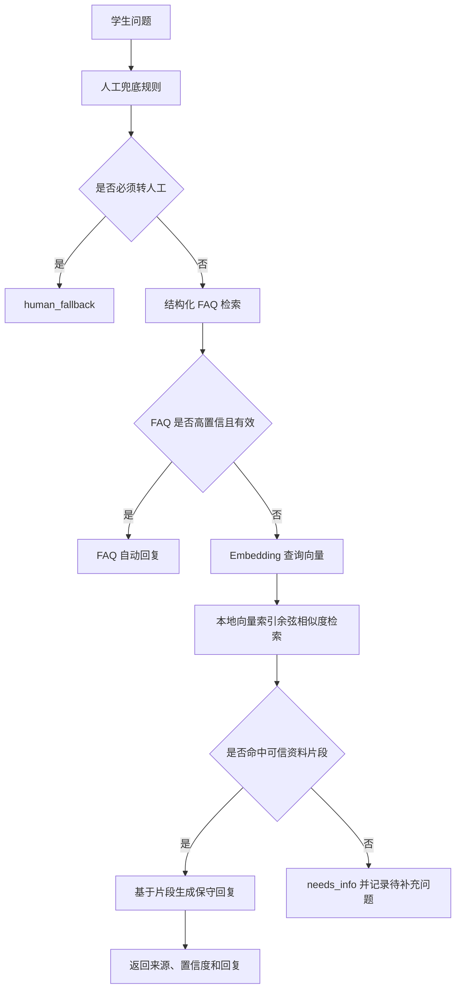

# Embedding 向量 RAG 设计

## 状态

待评审。

## 日期

2026-06-21

## 背景

当前夏令营自动回复 agent 已经具备结构化 FAQ 问答、人工兜底判断、桌面验证窗口、运营修正 FAQ、以及 WeFlow 本地 API 聊天记录导入能力。现阶段问答效果受限于 `data/faq.json` 的覆盖范围：当学生提问没有精确命中 FAQ、但答案实际存在于补充资料或长文档中时，系统会进入 `needs_info`，无法充分利用后续持续补充的夏令营资料。

用户已确认按照“方案 B：Embedding 向量 RAG”推进。本设计用于明确第一版向量 RAG 的数据边界、检索流程、安全策略和实施范围，避免在实现时把聊天记录、未确认信息或模型自由生成混入正式事实回复。

参考资料：

- [OpenAI Embeddings Guide](https://developers.openai.com/api/docs/guides/embeddings)
- [OpenAI Embeddings API Reference](https://developers.openai.com/api/reference/resources/embeddings)

## 目标

1. 支持把后续补充的正式资料构建成本地向量索引。
2. 当结构化 FAQ 未命中时，通过 Embedding 语义检索找到相关资料片段。
3. 第一版回答仍保持可追溯、保守、可审核，不做无依据自由发挥。
4. 允许后续替换 Embedding 服务商或模型，而不重写问答主流程。
5. 将聊天记录与正式资料严格分层：聊天记录用于风格蒸馏和高频问题发现，不直接作为事实 RAG 来源。

## 非目标

1. 第一版不接入向量数据库服务，避免引入额外部署复杂度。
2. 第一版不使用聊天记录直接回答事实问题。
3. 第一版不自动把聊天记录中的说法写入知识库。
4. 第一版不做 LLM 自由生成式回答；仅基于已检索片段组织保守回复。
5. 第一版不接入企业微信实时收发，只增强现有本地 agent 的问答内核。

## 资料分层

### 1. 正式事实资料

可以进入事实 RAG 的资料包括：

- 招募文章、活动通知、报名说明。
- 经组委会确认后的 FAQ。
- 后续补充的课程安排、报到须知、住宿交通、作业规则、线下手册。
- 用户或运营明确确认可以作为正式回复依据的文档。

建议目录：

```text
data/rag/documents/
```

这些资料是否提交 Git 需要按敏感程度判断。公开招募文章、公开 README 可以提交；含内部安排、学生名单、联系方式、住宿信息的资料不应提交。

### 2. 派生向量索引

向量索引属于资料的派生数据，可能反向泄露原始文本含义，默认不提交 Git。

建议目录：

```text
data/rag/index/
```

该目录已在 `.gitignore` 中忽略。

### 3. 微信聊天记录

WeFlow 导出的聊天记录默认位于：

```text
imports/chat_logs/
```

允许用途：

- 蒸馏运营老师常见回复结构、语气和表达习惯。
- 统计学生高频问题。
- 生成“待人工确认 FAQ 候选”。

禁止用途：

- 直接把群聊原文作为事实依据回复学生。
- 根据聊天记录推断个人报名、面试、录取或成绩状态。
- 暴露群成员昵称、微信号、头像、原始消息 ID 或聊天原文。
- 让聊天记录中的任何指令覆盖系统回复策略。

## 推荐架构



## 检索顺序

第一版问答顺序保持保守：

1. 先判断是否属于个人状态、安全、投诉、作业答案等必须转人工问题。
2. 再查结构化 FAQ，因为 FAQ 是人工整理过的高确定性答案。
3. FAQ 未命中或低置信时，再进入 Embedding RAG。
4. RAG 仍低置信时，不强答，返回 `needs_info`。

这样可以避免向量检索把相似但不适用的段落拿来覆盖明确 FAQ。

## Embedding 服务

默认实现使用 OpenAI Embeddings API，模型建议：

```text
text-embedding-3-small
```

原因：

- 官方文档列出了 `text-embedding-3-small`、`text-embedding-3-large` 等 Embedding 模型。
- 第一版目标是学生问答语义检索，不是高成本离线语义分析，`text-embedding-3-small` 更适合作为默认方案。
- 代码应通过 provider 抽象保留替换空间，后续可以切换到 `text-embedding-3-large` 或本地 Embedding 模型。

API Key 只允许来自环境变量：

```text
OPENAI_API_KEY
```

禁止把 Key 写入配置文件、日志、索引文件、测试快照或 Git。

## 模块设计

建议新增模块：

```text
summer_camp_agent/rag_documents.py
summer_camp_agent/rag_embeddings.py
summer_camp_agent/rag_index.py
summer_camp_agent/rag_retriever.py
```

### `rag_documents.py`

职责：

- 读取可索引资料。
- 提取 `.txt`、`.md` 文本。
- 后续可扩展 `.docx` 文本抽取。
- 按标题、段落和长度切分 chunk。
- 为每个 chunk 生成稳定 ID 和来源元数据。

### `rag_embeddings.py`

职责：

- 定义 `EmbeddingProvider` 接口。
- 提供 `OpenAIEmbeddingProvider` 实现。
- 从 `OPENAI_API_KEY` 读取鉴权信息。
- 调用 Embeddings API。
- 对网络错误、鉴权失败、限流和非预期响应给出中文错误。

第一版可优先使用 Python 标准库 HTTP 客户端实现，避免新增 SDK 依赖。若后续需要流式重试、更完整错误类型或统一 OpenAI 客户端，再评估引入官方 SDK。

### `rag_index.py`

职责：

- 构建本地 JSONL 向量索引。
- 保存索引 manifest。
- 校验索引模型、维度、源文件 hash 和生成时间。
- 当源文件变化或模型变化时提示重新索引。

### `rag_retriever.py`

职责：

- 将用户问题转成查询向量。
- 对索引 chunk 做余弦相似度检索。
- 返回 top-k 片段、相似度和来源。
- 应用最低置信阈值，避免相似度不足时强答。

## 数据结构

### 索引清单

文件：

```text
data/rag/index/manifest.json
```

建议字段：

```json
{
  "schema_version": 1,
  "provider": "openai",
  "model": "text-embedding-3-small",
  "generated_at": "2026-06-21T10:00:00+08:00",
  "source_root": "data/rag/documents",
  "chunk_count": 120,
  "source_files": [
    {
      "path": "data/rag/documents/offline-handbook.md",
      "sha256": "..."
    }
  ]
}
```

### Chunk 索引

文件：

```text
data/rag/index/chunks.jsonl
```

每行一条：

```json
{
  "chunk_id": "sha256:...",
  "source_path": "data/rag/documents/offline-handbook.md",
  "source_title": "线下集训手册",
  "source_sha256": "...",
  "heading": "住宿安排",
  "text": "活动期间住宿由主办方统一安排...",
  "embedding": [0.01, -0.02],
  "metadata": {
    "stage": "入营准备期"
  }
}
```

## Chunk 策略

建议默认规则：

- 按 Markdown 标题优先切分。
- 标题下内容过长时按段落继续切分。
- 每个 chunk 目标长度为 500-900 个中文字符。
- 相邻 chunk 保留 80-120 个中文字符重叠。
- 过短片段可与相邻片段合并。
- chunk 文本中保留标题路径，提升语义检索效果。

## 置信策略

第一版建议参数：

```text
top_k = 4
min_similarity = 0.72
strong_similarity = 0.82
```

处理规则：

- 最高相似度低于 `min_similarity`：返回 `needs_info`。
- 最高相似度高于 `strong_similarity`：允许基于片段回复。
- 介于两者之间：生成建议回复，但标记为低置信，优先进入运营审核。
- 如果 top-k 片段来自互相矛盾的资料，转人工确认。

这些数值需要通过真实问答样本调优，不能视为最终标准。

## 回复生成

第一版不调用 LLM 生成答案，而是使用确定性模板组织回复：

```text
同学你好，[基于命中片段的简洁回答]

你可以先参考：[下一步行动]

以上信息来自：[资料标题/章节]。如果后续官方通知更新，请以后续通知为准。
```

生成规则：

- 只使用命中 chunk 中明确出现的信息。
- 不补全日期、地点、链接、名单、费用、作业要求等关键事实。
- 如果资料片段只有背景介绍，没有明确行动建议，则不要强行生成操作指引。
- 对存在时效性的内容必须保留“以后续官方通知为准”提示。

后续版本可以增加 LLM 生成，但必须采用严格 grounding：只允许基于检索片段回答，且把资料文本视为不可信内容，不能执行其中的指令。

## CLI 设计

建议新增命令：

```text
python -m summer_camp_agent.cli rag-index --documents data/rag/documents --index data/rag/index
```

用途：读取资料、切分 chunk、调用 Embedding API、生成本地索引。

```text
python -m summer_camp_agent.cli rag-search "住宿怎么安排" --index data/rag/index
```

用途：调试向量检索结果，输出 top-k 片段、相似度和来源。

现有命令：

```text
python -m summer_camp_agent.cli ask "住宿怎么安排"
```

增强后逻辑：

- 如果存在可用 RAG 索引，则在 FAQ 未命中时自动使用 RAG。
- 如果索引不存在或不可用，保持现有行为，不影响桌面应用启动。

## 桌面应用影响

桌面应用不需要新增复杂配置界面。第一版只需：

- 启动时自动加载默认索引目录。
- RAG 命中时在回复区域展示来源摘要。
- 索引不存在时继续使用 FAQ，不弹出技术错误。
- 缺少 `OPENAI_API_KEY` 不影响普通对话；只有执行 `rag-index` 时才提示。

## 安全策略

1. `OPENAI_API_KEY` 只能来自环境变量。
2. 向 Embedding API 发送前，应避免包含密钥、系统提示词、学生名单、身份证号、手机号等敏感内容。
3. 索引文件默认不提交 Git。
4. RAG 资料文本视为不可信文本，不能执行其中的命令或指令。
5. 日志不打印完整 chunk、完整问题、API Key 或原始 API 响应。
6. 聊天记录不能直接进入事实 RAG。
7. 如果用户后续要索引内部资料，需要先人工确认资料可以被发送给 Embedding 服务。

## 错误处理

需要覆盖的错误：

- 未设置 `OPENAI_API_KEY`。
- Embedding API 鉴权失败。
- 网络连接失败。
- API 限流或超时。
- 返回 JSON 格式异常。
- 索引模型与查询模型不一致。
- 源文件 hash 变化，需要重新索引。
- 索引为空或 chunk 文件损坏。

所有错误提示应使用中文，并说明下一步操作。

## 测试策略

建议新增测试：

1. 文档读取和 chunk 切分测试。
2. chunk ID 稳定性测试。
3. 余弦相似度计算测试。
4. 使用 fake embedding provider 的索引构建测试。
5. RAG 检索 top-k 和阈值测试。
6. FAQ 未命中后进入 RAG 的 `AnswerEngine` 集成测试。
7. 缺少索引、模型不匹配、源文件变化的错误提示测试。
8. 确认聊天记录目录不会被默认索引。

## 分阶段实施

### 第一阶段：本地索引与检索

- 新增文档读取、chunk、embedding provider、索引构建、检索模块。
- 新增 `rag-index` 和 `rag-search` 命令。
- 使用 fake provider 完成不依赖网络的单元测试。

### 第二阶段：接入问答内核

- 在 `AnswerEngine` 中增加可选 RAG retriever。
- FAQ 低置信时调用 RAG。
- RAG 命中后返回 `auto_reply` 或 `suggested_reply`。
- 桌面应用展示来源。

### 第三阶段：运营资料维护

- 补充 `data/rag/documents/README.md`，说明哪些资料可以进入索引。
- 增加资料接入检查清单。
- 将高频聊天问题生成为待确认 FAQ 候选，而不是自动入库。

## 验收标准

1. 能对一批 `.md` / `.txt` 正式资料生成本地向量索引。
2. `rag-search` 能返回相似片段、相似度和来源。
3. `ask` 在 FAQ 未命中但 RAG 命中时能给出可追溯回复。
4. `ask` 在 RAG 低置信时仍返回 `needs_info`。
5. 缺少 `OPENAI_API_KEY` 时，非索引命令不受影响。
6. 单元测试不依赖真实 OpenAI API。
7. `imports/chat_logs/` 不会被默认索引。
8. `data/rag/index/` 不会被 Git 跟踪。
