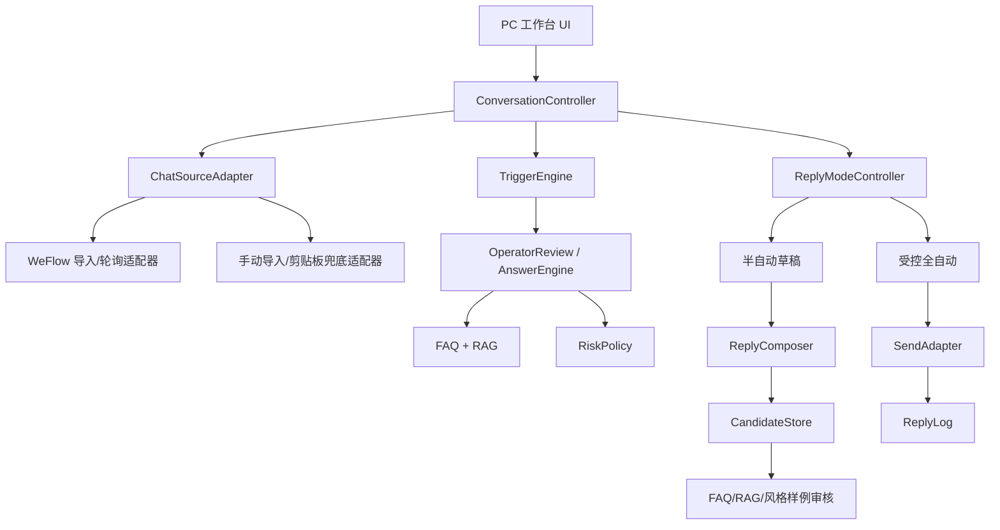
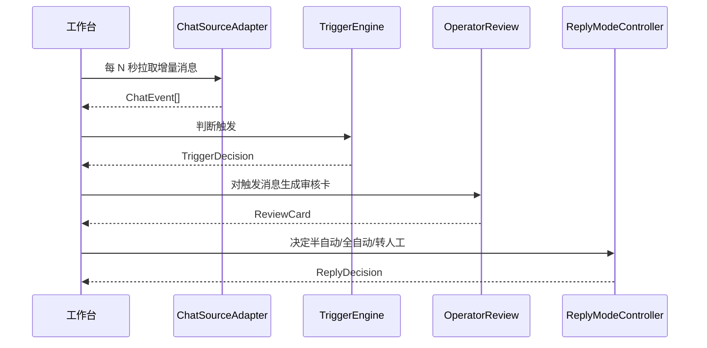

# PC 端群聊答疑运营工作台技术方案

## 状态

待评审。

## 日期

2026-06-21

## 背景

当前项目已经具备以下能力：

- `AnswerEngine`：基于人工兜底规则、结构化 FAQ 和 RAG 给出回复决策。
- `OperatorReview`：生成运营审核卡。
- `DesktopChatSession`：提供本地桌面对话验证入口。
- `WeFlowImportClient`：通过 WeFlow 本地 API 导入指定微信群聊历史记录。
- `chat_log_sanitizer`：对聊天记录做脱敏、去重和关键词过滤。
- `rag_*` 模块：支持正式资料的 Embedding RAG 索引和检索。

新的 PC 端工作台需要把这些能力从“单轮本地问答验证”升级为“群聊运营处理流”：导入群聊、监听触发、生成草稿、半自动确认、受控全自动、候选库沉淀和日志追踪。

## 目标

1. 提供 PC 端客服运营工作台的技术架构。
2. 支持选择群聊导入历史聊天内容。
3. 支持监听指定群聊的新消息。
4. 只处理 `@Agent`、关键词和问号相关消息。
5. 支持半自动模式：生成草稿并填入回复框，由人工确认或修改。
6. 支持受控全自动模式：仅对高置信、低风险、来源明确的问题自动回复。
7. 人工修改后的内容进入待审核候选库，不直接覆盖正式知识库。

## 非目标

1. 不破解微信数据库。
2. 不实现隐藏式微信 hook 或未授权客户端注入。
3. 不做多账号、多群批量营销能力。
4. 不把聊天记录直接作为事实 RAG 来源。
5. 第一版不承诺普通微信个人群的稳定自动发送能力。
6. 第一版不替代企业微信官方应用接入方案。

## 总体架构



## 模块边界

### 1. `ChatSourceAdapter`

职责：

- 抽象群聊消息来源。
- 支持历史导入和增量监听。
- 输出统一的内部消息结构。

第一版实现：

- `WeFlowChatSourceAdapter`：基于 WeFlow 本地 API 拉取群聊消息。
- `ManualChatSourceAdapter`：允许运营粘贴/导入消息，用于兜底验证。

统一消息结构：

```python
@dataclass(frozen=True)
class ChatEvent:
    event_id: str
    group_id_hash: str
    group_name: str
    sender_alias: str
    sender_role: str
    message_time: str
    content: str
    raw_type: str
    source: str
```

安全约束：

- 不保留原始微信 ID。
- 不保留头像、本地媒体路径、Token 或原始 API 响应。
- 只允许连接本机 WeFlow API。

### 2. `TriggerEngine`

职责：

- 判断新消息是否需要进入 Agent。
- 减少闲聊误触发。
- 记录触发原因。

触发条件：

```python
@dataclass(frozen=True)
class TriggerDecision:
    should_process: bool
    reasons: list[str]
    matched_keywords: list[str]
```

第一版规则：

1. 内容包含 `@Agent` 或配置的机器人昵称。
2. 命中关键词：报名、住宿、交通、作业、面试、通知、报到、GPU、算子等。
3. 包含问号，且命中夏令营相关词。

默认忽略：

- 空消息。
- 纯媒体消息。
- 纯表情消息。
- 已由运营老师明确回复的重复消息。

### 3. `RiskPolicy`

职责：

- 在生成或发送前判断是否必须转人工。
- 为全自动模式提供硬性拦截。

风险类型：

```python
class RiskType:
    PERSONAL_STATUS = "personal_status"
    SAFETY = "safety"
    COMPLAINT = "complaint"
    TECHNICAL_ASSIGNMENT = "technical_assignment"
    STALE_SOURCE = "stale_source"
    UNKNOWN = "unknown"
```

现有 `AnswerEngine._human_fallback` 可以作为第一版基础，后续独立成策略模块。

### 4. `ReplyModeController`

职责：

- 根据群聊配置、风险结果和置信度决定回复模式。
- 输出半自动草稿、全自动发送或转人工。

输入：

- `TriggerDecision`
- `ReviewCard`
- 群聊配置
- 全自动白名单意图
- 当前系统状态

输出：

```python
@dataclass(frozen=True)
class ReplyDecision:
    mode: str  # ignored | draft | auto_send | escalate | mark_pending
    reply: str
    source: str
    confidence: float
    reason: str
    requires_review: bool
```

决策规则：

1. 未触发消息：`ignored`。
2. 高风险消息：`escalate`。
3. FAQ/RAG 低置信：`mark_pending` 或 `draft`。
4. 半自动模式：默认 `draft`。
5. 全自动模式：只有命中白名单意图、高置信、来源明确且无风险时 `auto_send`。

### 5. `ReplyComposer`

职责：

- 管理回复输入框内容。
- 保存人工修改前后的差异。
- 生成候选库记录。

候选记录：

```python
@dataclass(frozen=True)
class ReplyCandidate:
    candidate_id: str
    group_name: str
    original_question: str
    agent_reply: str
    edited_reply: str
    source: str
    confidence: float
    candidate_type: str  # faq | rag_document | style_sample | deny_rule
    status: str  # pending | accepted | ignored
    created_at: str
```

第一版存储：

```text
data/reply_candidates.jsonl
```

该文件属于本地运营数据，默认不提交 Git。

### 6. `SendAdapter`

职责：

- 抽象回复发送动作。
- 区分“复制到剪贴板”“人工发送”“受控适配器发送”。

第一版建议实现：

- `ManualSendAdapter`：把回复复制到剪贴板或填入工作台输入框，由运营发送。
- `DryRunSendAdapter`：只记录日志，不真实发送，用于全自动模式验证。

后续再评估：

- WeFlow 或其他本地适配器是否能合规发送。
- 企业微信官方应用或 webhook 的发送路径。

### 7. `ReplyLog`

职责：

- 记录每次回复行为。
- 支持回溯误答、自动回复审计和质量评估。

日志字段：

```json
{
  "log_id": "sha256:...",
  "group_name": "咨询群",
  "trigger_message_hash": "sha256:...",
  "trigger_reasons": ["keyword", "question_mark"],
  "mode": "draft",
  "action": "send",
  "reply": "同学你好...",
  "source": "FAQ / 招募文章",
  "confidence": 0.96,
  "operator_action": "edited_and_sent",
  "created_at": "2026-06-21T12:00:00+08:00"
}
```

第一版存储：

```text
data/reply_logs.jsonl
```

## 群聊配置

建议本地配置文件：

```text
data/chat_groups.json
```

结构：

```json
[
  {
    "group_id_hash": "sha256:...",
    "group_name": "夏令营咨询群",
    "enabled": true,
    "mode": "semi_auto",
    "keywords": ["报名", "住宿", "交通", "作业", "面试", "通知"],
    "agent_mentions": ["@Agent", "@夏令营助手"],
    "auto_reply_intents": [
      "registration.link",
      "registration.deadline",
      "offline.time",
      "offline.location",
      "cost.accommodation",
      "cost.transportation",
      "notice.channel",
      "rag.document"
    ],
    "daily_auto_reply_limit": 50
  }
]
```

该配置属于本地运行数据，默认不提交 Git。

## 监听策略

第一版采用轮询，不做客户端注入：



轮询参数：

- 默认间隔：3-5 秒。
- 异常退避：连续失败后逐步延长到 30 秒。
- 去重依据：`event_id` 或消息哈希。
- 每次只处理未见过的新消息。

## 半自动模式

默认路径：

1. 新消息进入。
2. `TriggerEngine` 判断是否处理。
3. `OperatorReview` 生成回复卡。
4. `ReplyModeController` 输出 `draft`。
5. UI 把草稿填入输入框。
6. 运营编辑或直接发送。
7. 若发生编辑，保存 `ReplyCandidate`。
8. 写入 `ReplyLog`。

## 全自动模式

必须满足全部条件：

1. 群聊开启全自动。
2. 消息命中触发规则。
3. 未触发 `RiskPolicy`。
4. `ReviewCard.action == auto_reply`。
5. `confidence >= auto_reply_threshold`。
6. `intent` 在 `auto_reply_intents` 白名单。
7. `source` 非空。
8. 未超过每日自动回复上限。

失败任一条件则降级为半自动草稿或转人工。

## 数据文件建议

默认忽略 Git：

```text
data/chat_groups.json
data/reply_candidates.jsonl
data/reply_logs.jsonl
data/listener_state.json
```

需要同步 `.gitignore`。

## 与现有模块的关系

| 新能力 | 复用现有模块 | 说明 |
| --- | --- | --- |
| 群聊导入 | `weflow_import.py` | 复用本地 API、脱敏和 JSONL 输出 |
| 消息脱敏 | `chat_log_sanitizer.py` | 继续使用成员别名和哈希 |
| 回复决策 | `engine.py` | FAQ + RAG + 人工兜底 |
| 半自动审核 | `review.py` | 继续产出 `ReviewCard` |
| RAG | `rag_*` | 正式资料检索，不使用聊天原文作事实来源 |
| 桌面验证 | `desktop_chat.py` / `gui.py` | 后续演进为工作台 UI |

## 测试策略

1. `TriggerEngine`：覆盖 `@Agent`、关键词、问号、无关闲聊。
2. `ReplyModeController`：覆盖半自动、全自动、降级、转人工。
3. `ReplyCandidate`：覆盖人工修改保存为候选，不直接入 FAQ。
4. `ReplyLog`：覆盖发送日志字段完整性。
5. `ChatSourceAdapter`：用 fake source 测试增量消息和去重。
6. UI 会话层：测试选群、收消息、生成草稿、修改、发送。
7. 安全测试：聊天记录不进入 RAG，个人状态类问题不会自动发送。

## 分阶段实施

### 第一阶段：本地工作台骨架

- 新增工作台 UI 布局。
- 左侧群聊列表使用本地配置或示例数据。
- 中间消息流读取导入 JSONL。
- 右侧展示 `ReviewCard`。
- 底部支持半自动草稿和人工修改。

### 第二阶段：监听与触发

- 新增 `ChatSourceAdapter`。
- 新增 `TriggerEngine`。
- 支持 WeFlow 本地 API 轮询增量消息。
- 支持关键词配置。

### 第三阶段：候选库与日志

- 新增 `ReplyCandidate` 保存。
- 新增 `ReplyLog` 保存。
- UI 支持候选审核入口。

### 第四阶段：受控全自动

- 新增 `ReplyModeController`。
- 新增全自动白名单意图和每日上限。
- 先接 `DryRunSendAdapter` 验证，再评估真实发送适配器。

## 验收标准

1. 可以选择群聊并查看导入消息流。
2. 只对 `@Agent`、关键词、问号相关消息生成草稿。
3. 半自动模式会把回复建议填入输入框。
4. 人工修改后的内容进入待审核候选库。
5. 全自动模式只对高置信低风险白名单意图生效。
6. 自动回复失败或不满足条件时能降级为半自动。
7. 所有发送和候选沉淀都有本地日志。
8. 聊天记录不会直接进入事实 RAG。
