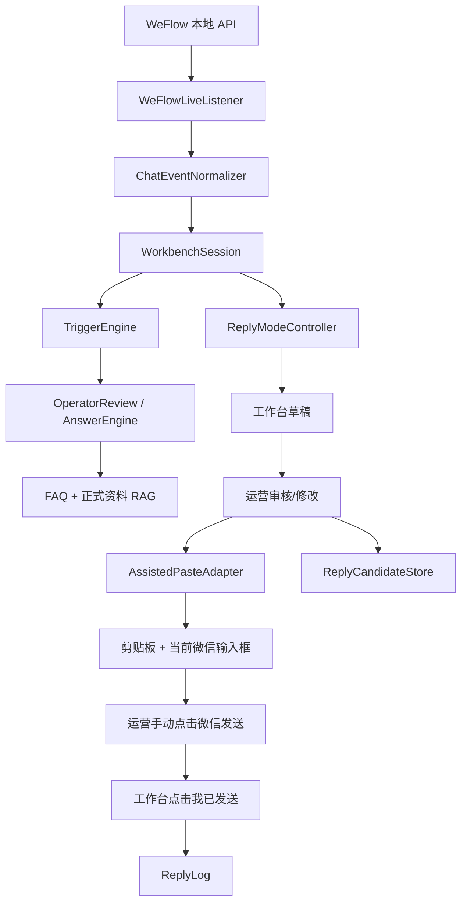
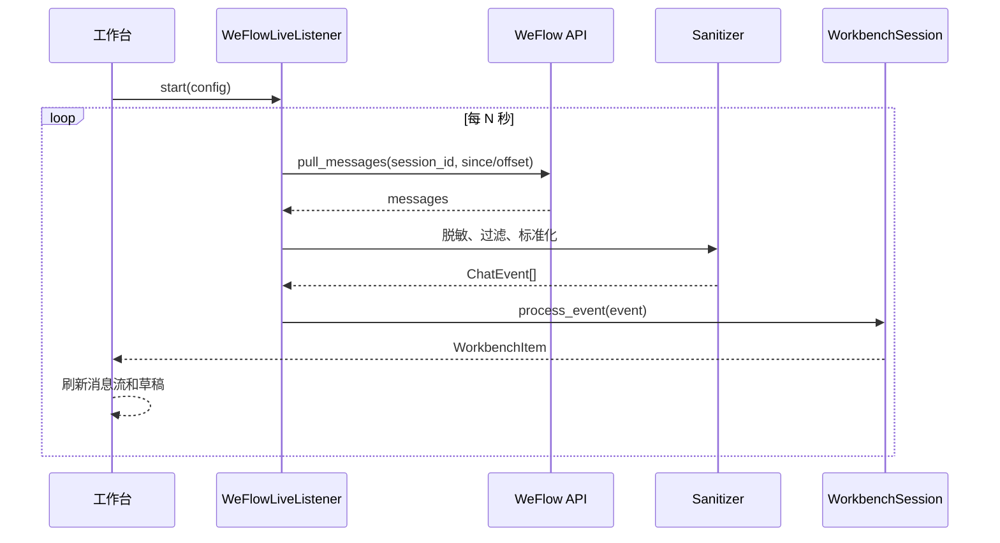

# 微信半自动辅助交互技术方案

## 状态

待评审。

## 日期

2026-06-21

## 背景

当前项目已经具备一个可演示的 PC 端群聊答疑运营工作台：

- 浏览器版工作台可显示群聊消息流、决策面板和回复输入区。
- `WeFlowImportClient` 已能通过 WeFlow 本地 API 拉取并脱敏导出微信群聊天记录。
- `WorkbenchSession` 已能串联触发判断、FAQ/RAG 回复、人工兜底、候选库和回复日志。
- `ReplyCandidateStore` 和 `ReplyLogStore` 已能把人工修改和发送动作写入本地 JSONL。

下一步要打通和微信的交互。用户已选择方案 B：半自动辅助发送版。该方案允许系统辅助监听微信群新消息、生成草稿，并把最终回复粘贴到微信输入框，但最后发送必须由运营人工确认。

## 目标

1. 在工作台内配置并监听一个 WeFlow 可访问的普通微信群。
2. 持续把新消息拉入工作台消息流，并复用现有触发、RAG 和审核逻辑生成草稿。
3. 支持运营修改草稿后点击“填入微信”，系统把回复复制到剪贴板并尝试粘贴到当前微信输入框。
4. 系统不自动按回车、不自动点击发送按钮。
5. 运营在微信中人工确认并发送后，再回到工作台点击“我已发送”记录日志。
6. 若自动粘贴失败，则降级为“已复制到剪贴板，请手动粘贴”。
7. 所有关键动作可审计：草稿生成、复制/粘贴、人工确认发送、候选保存。

## 非目标

1. 不破解微信数据库。
2. 不提取微信密钥。
3. 不注入微信客户端进程。
4. 不 hook 微信窗口或网络请求。
5. 不后台隐藏式发送消息。
6. 不模拟 Enter 键、发送按钮点击或任何不可见群发动作。
7. 不把聊天记录直接作为事实 RAG 来源。
8. 第一版不实现多群大规模自动营销能力。

## 总体方案



第一版拆成两条明确链路：

1. **监听链路**：WeFlow 本地 API → 增量轮询 → 脱敏标准化 → 工作台消息流。
2. **辅助发送链路**：工作台草稿 → 运营确认 → 复制到剪贴板 → 可选粘贴到当前窗口 → 运营手动发送 → 本地日志。

## 安全边界

### 允许

- 读取用户本机手动开启的 WeFlow HTTP API。
- 拉取指定群聊的新增消息。
- 对消息做脱敏、去重和触发判断。
- 将回复复制到系统剪贴板。
- 在用户明确点击按钮后，对当前前台窗口执行一次 `Ctrl+V` 粘贴。
- 记录“已复制”“已尝试粘贴”“运营确认已发送”等本地审计日志。

### 禁止

- 自动定位并点击微信发送按钮。
- 自动按下 Enter。
- 在用户没有明确点击“填入微信”时操作剪贴板或窗口。
- 在后台窗口执行粘贴。
- 绕过用户确认发送消息。
- 在日志中保存 WeFlow Token、原始微信 ID、原始昵称或原始会话 ID。

### 降级策略

如果无法确认当前窗口、Windows 自动化失败、剪贴板写入失败或用户未聚焦微信输入框：

1. 工作台显示清晰中文提示。
2. 保留回复文本在工作台输入框。
3. 尽量完成复制到剪贴板。
4. 不再继续尝试粘贴。
5. 不记录为“已发送”。

## 监听设计

### 本地配置

建议新增本地文件：

```text
data/wechat_bridge_config.json
```

示例结构：

```json
{
  "base_url": "http://127.0.0.1:5031",
  "token_env": "WEFLOW_API_TOKEN",
  "group_name": "沐曦开源英才夏令营咨询群",
  "session_id": "",
  "keywords": ["报名", "报到", "住宿", "交通", "作业", "面试", "GPU", "算子"],
  "poll_interval_seconds": 5,
  "enabled": true
}
```

说明：

- `token_env` 只保存环境变量名，不保存 Token 明文。
- `session_id` 可为空；为空时通过群名搜索，会话多匹配时要求用户选择。
- 配置文件属于本地运行数据，默认不提交 Git。

### 监听状态

建议复用或新增：

```text
data/listener_state.json
```

示例结构：

```json
{
  "session_id_hash": "sha256:...",
  "last_poll_at": "2026-06-21T18:00:00+08:00",
  "last_message_time": "2026-06-21 17:59:50",
  "seen_event_ids": ["sha256:..."],
  "consecutive_errors": 0
}
```

状态文件只保存哈希和去重信息，不保存原始微信 ID。

### 轮询流程



第一版策略：

- 默认轮询间隔为 5 秒。
- 只处理未见过的 `event_id`。
- 连续失败后退避：5 秒、10 秒、20 秒、30 秒封顶。
- 网络或 Token 错误只更新状态栏，不清空当前消息流。
- 多群匹配时不猜测目标群，要求用户明确选择 `session_id`。

## 辅助粘贴设计

### 用户操作流程

1. 工作台生成草稿。
2. 运营修改或确认草稿。
3. 运营先在微信里点到目标群聊输入框。
4. 回到工作台点击“填入微信”。
5. 工作台把回复写入剪贴板。
6. 工作台尝试对当前前台窗口执行一次 `Ctrl+V`。
7. 运营在微信里人工确认内容。
8. 运营手动点击微信发送。
9. 回到工作台点击“我已发送”。

为了减少误粘贴，UI 文案必须明确提示：

```text
请先把光标放到目标微信群输入框。本操作只粘贴，不会自动发送。
```

### 粘贴适配器

建议新增模块：

```text
summer_camp_agent/wechat_assisted_paste.py
```

核心接口：

```python
@dataclass(frozen=True)
class PasteResult:
    action: str  # copied | pasted | failed
    message: str
    foreground_window_title: str = ""


class AssistedPasteAdapter:
    def copy_only(self, text: str) -> PasteResult:
        ...

    def paste_to_foreground(self, text: str) -> PasteResult:
        ...
```

第一版实现：

- `copy_only`：只写入剪贴板。
- `paste_to_foreground`：先写剪贴板，再对当前前台窗口发送一次 `Ctrl+V`。
- 若无法使用 Windows 桌面自动化，则返回 `copied`，提示用户手动粘贴。

### Windows 实现建议

优先使用 Python 标准库 `ctypes` 调用 Win32 API：

- `OpenClipboard`
- `EmptyClipboard`
- `SetClipboardData`
- `GetForegroundWindow`
- `GetWindowTextW`
- `SendInput`

不使用 shell 执行任意脚本，不使用不透明第三方自动化库。若后续为了稳定性引入 `pywin32` 或其他库，必须单独评估依赖和权限边界。

### 防误发送约束

`AssistedPasteAdapter` 必须保证：

- 不调用 Enter。
- 不点击鼠标。
- 不查找或点击“发送”按钮。
- 不循环重试粘贴。
- 不对非前台窗口发送输入。
- 粘贴动作必须由用户点击工作台按钮触发。

## 工作台 UI 变化

### 左侧群聊区

新增：

- WeFlow 连接状态。
- 群聊名称输入。
- Token 环境变量提示。
- “开始监听”“停止监听”按钮。

第一版可先使用简单配置面板，不做复杂账号管理。

### 中间消息流

新增状态：

| 状态 | 含义 |
| --- | --- |
| 监听中 | 当前群聊正在从 WeFlow 轮询新消息 |
| 新消息 | 最近一次轮询拉入的新消息 |
| 已填入微信 | 回复已复制并尝试粘贴到微信输入框 |
| 待确认发送 | 需要运营在微信中手动发送后回到工作台确认 |
| 已确认发送 | 运营已点击“我已发送” |

### 底部回复区

新增按钮：

- “填入微信”：复制并尝试粘贴到当前微信输入框。
- “我已发送”：运营手动发送后记录发送日志。

保留按钮：

- “保存候选”
- “复制”
- “生成草稿”

### 状态栏

需要显示：

- 当前监听状态。
- 最近一次轮询结果。
- 粘贴结果。
- 失败降级提示。

## 本地 Web API 变化

当前浏览器版工作台已有本地 API：

- `GET /api/demo`
- `GET /api/items`
- `POST /api/ask`
- `POST /api/import-jsonl`
- `POST /api/send`
- `POST /api/save-candidate`

建议新增：

### `POST /api/wechat/config`

保存或更新本地监听配置。

输入：

```json
{
  "base_url": "http://127.0.0.1:5031",
  "token_env": "WEFLOW_API_TOKEN",
  "group_name": "沐曦开源英才夏令营咨询群",
  "session_id": "",
  "keywords": ["报名", "住宿"],
  "poll_interval_seconds": 5
}
```

输出：

```json
{
  "status": "ok",
  "message": "配置已保存"
}
```

### `POST /api/wechat/start`

启动监听。

输出：

```json
{
  "status": "ok",
  "message": "已开始监听",
  "listener_state": {
    "running": true,
    "group_name": "沐曦开源英才夏令营咨询群"
  }
}
```

### `POST /api/wechat/stop`

停止监听。

输出：

```json
{
  "status": "ok",
  "message": "已停止监听"
}
```

### `POST /api/wechat/paste`

复制并尝试粘贴当前回复。

输入：

```json
{
  "event_id": "sha256:...",
  "reply": "同学你好，报名入口为..."
}
```

输出：

```json
{
  "status": "ok",
  "paste_action": "pasted",
  "message": "已填入当前前台窗口，请在微信中确认后手动发送"
}
```

如果只能复制：

```json
{
  "status": "ok",
  "paste_action": "copied",
  "message": "已复制到剪贴板，请手动粘贴到微信输入框"
}
```

### `POST /api/wechat/confirm-sent`

运营手动发送后确认。

输入：

```json
{
  "event_id": "sha256:...",
  "reply": "最终发送内容"
}
```

输出：

```json
{
  "status": "ok",
  "message": "已记录运营确认发送"
}
```

## 日志设计

建议扩展 `ReplyLogEntry.operator_action`：

| 值 | 含义 |
| --- | --- |
| `draft_generated` | 已生成草稿 |
| `copied_to_clipboard` | 已复制到剪贴板 |
| `pasted_to_wechat` | 已尝试粘贴到前台窗口 |
| `operator_confirmed_sent` | 运营确认已手动发送 |
| `edited_and_confirmed_sent` | 运营修改后确认已手动发送 |
| `paste_failed` | 粘贴失败 |

第一版可以继续写入 `data/reply_logs.jsonl`，后续再独立审计表。

## 错误处理

### WeFlow 未启动

提示：

```text
无法连接 WeFlow API，请确认 WeFlow 已启动并开启 API 服务。
```

### Token 缺失或错误

提示：

```text
缺少 WEFLOW_API_TOKEN，请先在当前系统环境变量中设置 WeFlow Token。
```

或：

```text
WeFlow API 鉴权失败，请检查 WEFLOW_API_TOKEN。
```

不打印 Token 明文。

### 多群匹配

提示用户选择，不自动猜测：

```text
找到多个匹配群聊，请选择目标群聊后再开始监听。
```

### 粘贴失败

提示：

```text
已复制到剪贴板，但未能自动粘贴。请手动粘贴到微信输入框。
```

### 用户未确认发送

如果已经“填入微信”但没有点击“我已发送”，日志只能记为 `pasted_to_wechat` 或 `copied_to_clipboard`，不能记为 `sent`。

## 隐私和合规

1. 本项目只连接 `127.0.0.1` 或 `localhost` 上的 WeFlow API。
2. Token 只从环境变量读取，不写入配置、日志或导出文件。
3. 聊天记录在进入工作台前继续脱敏。
4. 候选库保留的是运营确认或修改后的内容，不直接把聊天原文写入正式知识库。
5. 日志中只保存消息哈希、群名、触发原因、回复内容和动作状态。
6. 若后续需要处理真实学生个人信息，应增加数据保留期限和手动清理入口。

## 测试策略

### 单元测试

1. `WeFlowLiveListener`
   - 能按配置拉取消息。
   - 能过滤已见消息。
   - 能把消息转换成 `ChatEvent`。
   - WeFlow 错误时返回中文错误状态。

2. `ListenerStateStore`
   - 能保存和读取 `last_message_time`、`seen_event_ids`。
   - 不保存原始 session id。

3. `AssistedPasteAdapter`
   - `copy_only` 空文本失败。
   - `copy_only` 正常文本返回 `copied`。
   - `paste_to_foreground` 在模拟失败时降级为 `copied` 或 `failed`。
   - 不存在任何发送 Enter 的实现路径。

4. `WorkbenchWebState`
   - 监听拉入新消息后进入消息流。
   - `paste` 只记录粘贴动作，不记录已发送。
   - `confirm-sent` 才记录运营确认发送。

### 集成测试

1. Fake WeFlow API 返回新消息，工作台 API 能展示新消息。
2. 对触发问题生成草稿并可调用 paste API。
3. paste 后调用 confirm-sent，日志动作正确。
4. 修改回复后 confirm-sent，候选库和日志都正确。

### 手动验证

1. 启动 WeFlow 并开启 API。
2. 启动工作台。
3. 配置群聊并开始监听。
4. 在群里发送测试问题。
5. 工作台出现消息和草稿。
6. 点击“填入微信”。
7. 确认微信输入框出现草稿，但不会自动发送。
8. 手动发送后点击“我已发送”。
9. 查看 `data/reply_logs.jsonl` 记录。

## 实施分期

### 第一阶段：监听配置和状态

- 新增 WeFlow 监听配置模型。
- 新增监听状态存储。
- 工作台 UI 增加配置与开始/停止监听按钮。
- 暂不做自动粘贴。

### 第二阶段：增量监听

- 新增 `WeFlowLiveListener`。
- 把新消息推入现有 `WorkbenchWebState.items`。
- 支持轮询、去重、错误退避。

### 第三阶段：辅助粘贴

- 新增 `AssistedPasteAdapter`。
- 新增“填入微信”按钮和 API。
- 默认只复制，Windows 可用时尝试粘贴到前台窗口。
- 不实现发送。

### 第四阶段：确认发送和审计

- 新增“我已发送”按钮和 API。
- 区分 `pasted_to_wechat` 与 `operator_confirmed_sent`。
- 修改后确认发送进入候选库。

## 验收标准

1. 用户可以在工作台中配置 WeFlow 本地 API、群名、关键词和轮询间隔。
2. 点击“开始监听”后，新微信群消息能进入工作台消息流。
3. 只有触发消息会生成回复草稿。
4. 点击“填入微信”后，系统不会自动发送消息。
5. 粘贴失败时能降级为复制到剪贴板，并给出中文提示。
6. 只有点击“我已发送”后，日志才记录为运营确认发送。
7. 修改后的发送内容进入待审核候选库。
8. 日志不包含 WeFlow Token、原始微信 ID 或原始 session id。
9. 全量测试通过，且有测试覆盖“不按 Enter、不自动发送”的安全边界。
