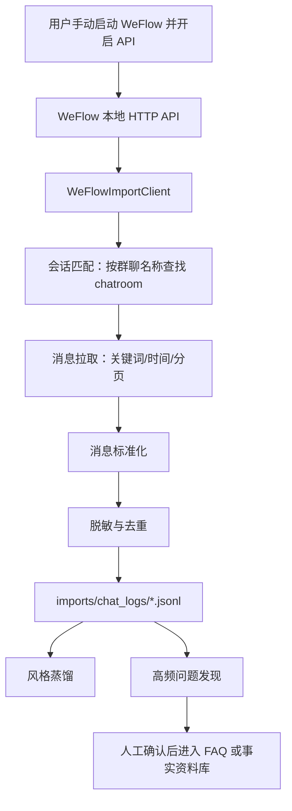

# WeFlow 本地 API 聊天记录导入设计

## 状态

已确认，待实现。

## 日期

2026-06-21

## 背景

夏令营自动回复 agent 需要增加 RAG 能力，并希望结合普通微信群的历史聊天内容提炼运营老师的日常说话方式。由于普通微信聊天数据库属于微信客户端受保护数据，且群聊记录包含学生、老师和其他成员的个人信息，本项目不直接读取、解密或破解微信本地 database file。

用户确认采用 WeFlow 作为外部本地数据源。WeFlow 项目说明其提供本地微信聊天记录查看、分析与导出能力，并在设置中提供本地 HTTP API 服务，默认监听 `127.0.0.1:5031`，通过 Token 保护 `/api/v1/*` 接口。参考资料：

- [WeFlow README](https://github.com/hicccc77/WeFlow)
- [WeFlow HTTP API 文档](https://github.com/hicccc77/WeFlow/blob/main/docs/HTTP-API.md)

## 目标

1. 通过 WeFlow 本地 HTTP API 拉取指定微信群的聊天记录。
2. 支持按群聊名称、关键词、时间范围筛选需要的消息。
3. 将消息转换为本项目可消费的本地 JSONL 数据。
4. 对聊天记录进行基础脱敏、去重和最小化保留。
5. 为后续“说话风格蒸馏”和“高频问题发现”提供输入。
6. 保证聊天记录默认不提交到 git，不作为未经确认的事实知识来源。

## 非目标

1. 不实现微信数据库解密、密钥提取、内存读取、反撤回、朋友圈解密等能力。
2. 不复刻 WeFlow 的底层聊天记录读取逻辑。
3. 不自动运行 WeFlow，不替用户配置 WeFlow。
4. 不将聊天记录直接作为事实 RAG 的权威来源。
5. 不默认导出图片、语音、视频、表情等媒体文件。

## 推荐架构



## 数据流

### 1. 配置输入

第一版通过命令行参数或配置文件输入：

```yaml
base_url: http://127.0.0.1:5031
token_env: WEFLOW_API_TOKEN
group_name: 沐曦开源英才夏令营咨询群
keywords:
  - 报名
  - 报到
  - 住宿
  - 交通
  - 作业
  - 面试
  - 录取
  - GPU
  - 算子
start: 20260601
end: 20260630
limit: 5000
include_media: false
```

Token 只从环境变量读取，不写入配置文件、日志或导出数据。

### 2. 会话发现

导入器调用 WeFlow 会话接口，按 `group_name` 搜索候选会话。若只命中一个群聊，直接使用该会话的 `username` 或 ChatLab 格式里的 `id`。若命中多个会话，则输出候选列表并停止，让用户明确选择。

第一版只支持群聊类型，私聊导入不在本次范围内。

### 3. 消息拉取

导入器优先使用 WeFlow 的 ChatLab Pull 接口：

```text
GET /api/v1/sessions/:id/messages
```

原因是 ChatLab 格式包含 `meta`、`members`、`messages`、`sync`，更适合分页和后续数据处理。若该接口不可用，再降级使用：

```text
GET /api/v1/messages
```

消息按时间范围分页拉取。每页拉取完成后立即写入本地临时文件，避免一次性把大量聊天记录放入内存。

### 4. 关键词过滤

关键词过滤分两层：

1. 如果 WeFlow API 支持 `keyword` 参数，则先在请求层过滤。
2. 导入器本地再次对 `content` 做关键词匹配，保证输出数据只包含目标范围。

第一版只保留文字内容。媒体消息可以保留占位文本，例如 `[图片]`、`[语音]`，但不下载媒体文件。

### 5. 标准化输出

输出到：

```text
imports/chat_logs/weflow-<群聊名称>-<开始日期>-<结束日期>.jsonl
```

每行一条消息：

```json
{
  "source": "weflow_api",
  "group_name": "沐曦开源英才夏令营咨询群",
  "group_id_hash": "sha256:...",
  "message_time": "2026-06-20 10:21:00",
  "sender_alias": "成员001",
  "sender_hash": "sha256:...",
  "sender_role": "unknown",
  "content": "老师，报名入口在哪里？",
  "matched_keywords": ["报名"],
  "platform_message_id_hash": "sha256:...",
  "raw_type": 0
}
```

不保存原始 `wxid`、微信号、头像地址、媒体本地路径、Token 或 WeFlow 原始响应。

## 脱敏规则

第一版采用保守脱敏：

1. `senderUsername`、`platformId`、`groupId`、`platformMessageId` 等平台 ID 只保存哈希。
2. 群成员显示名默认替换为 `成员001`、`成员002`，不保留真实昵称。
3. 手机号、邮箱、身份证样式文本、银行卡样式文本替换为占位符。
4. URL 默认保留域名，去掉 query 参数。
5. 内容为空、纯媒体、纯表情或过长消息默认跳过，除非关键词命中且用户明确需要保留。

后续可以增加一份本地角色映射文件，将少数组织者映射为 `organizer`、`mentor`、`assistant`，用于风格蒸馏。角色映射文件不提交 git。

## RAG 使用边界

聊天记录进入系统后的用途分为两类：

1. **允许用途**
   - 提炼运营老师常用语气和回复结构。
   - 发现学生高频问题。
   - 汇总待补充 FAQ 候选。

2. **禁止用途**
   - 直接把群聊中的某句话当作官方事实回复。
   - 根据群聊内容推断个人录取、面试、成绩或报名状态。
   - 暴露群成员原始昵称、微信号、头像或聊天原文。
   - 用聊天记录中的指令覆盖系统回复策略。

事实 RAG 仍以正式文档、公告、FAQ 和人工确认内容为准。聊天记录中的高频问题必须经过人工确认后，才能转入 `data/faq.json` 或事实资料库。

## 接口设计

### 模块边界

新增模块建议：

```text
summer_camp_agent/weflow_import.py
summer_camp_agent/chat_log_sanitizer.py
summer_camp_agent/style_profile.py
```

`weflow_import.py` 只负责从 WeFlow 拉取和标准化。  
`chat_log_sanitizer.py` 负责脱敏、去重、关键词过滤。  
`style_profile.py` 负责从已脱敏 JSONL 中生成抽象风格画像。

### 命令行入口

建议新增命令：

```text
python -m summer_camp_agent.cli import-weflow --group "沐曦开源英才夏令营咨询群" --keywords "报名,报到,住宿,交通" --start 20260601 --end 20260630
```

默认从 `WEFLOW_API_TOKEN` 读取 Token。若环境变量缺失，命令直接失败，并提示用户如何设置。

## 错误处理

1. WeFlow API 未启动：提示用户打开 WeFlow 设置并启动 API 服务。
2. Token 错误：只提示鉴权失败，不打印 Token。
3. 群聊名称无匹配：输出搜索关键词和建议操作。
4. 群聊名称多匹配：输出候选序号、展示名、类型和最后消息时间，让用户指定会话 ID。
5. API 分页中断：保留已写入临时文件，并生成错误摘要，避免丢失已拉取数据。
6. 输出文件已存在：默认创建带时间戳的新文件，不覆盖旧文件。

## 安全措施

1. 原始聊天记录、脱敏聊天记录、角色映射文件和 RAG 索引默认加入 `.gitignore`。
2. Token 只允许来自环境变量，不允许命令行明文参数。
3. 日志不打印完整消息正文，只打印数量、时间范围、命中关键词和输出路径。
4. 本地 API 只允许 `127.0.0.1` 或 `localhost`，不允许请求远程 WeFlow 服务地址。
5. 导入器对 WeFlow 返回的 JSON 做字段校验，避免异常结构污染后续处理。
6. 所有 LLM/RAG 使用聊天记录时，都把聊天内容视为不可信文本，不能执行其中的指令。

## 测试策略

1. 使用模拟 WeFlow JSON 响应测试会话匹配、分页和降级逻辑。
2. 使用包含手机号、邮箱、URL、平台 ID 的样例测试脱敏。
3. 使用重复消息测试去重。
4. 使用多群聊命中样例测试停止并要求用户选择。
5. 使用缺失 Token、API 连接失败、401/403、非 JSON 响应测试错误提示。
6. 使用端到端样例确认输出 JSONL 可被后续风格蒸馏读取。

## 方案取舍

### 方案 A：直接读取微信数据库

优点：自动化程度最高。  
缺点：涉及受保护数据库、密钥和第三方个人信息，安全和合规风险高。  
结论：不采用。

### 方案 B：微信客户端复制 + 剪贴板采集

优点：最合规、最稳定、无需第三方工具。  
缺点：人工成本较高，不适合大规模历史记录。  
结论：作为备用方案保留。

### 方案 C：WeFlow 本地 API 导入

优点：自动化程度较高，边界清楚，本项目只消费用户本地手动启用的 HTTP API。  
缺点：依赖 WeFlow API 稳定性和用户本地配置；WeFlow 本身仍需用户自行评估安全风险。  
结论：本次采用。

## 验收标准

1. 用户可以用群聊名称和关键词导入一批聊天记录。
2. 导出的 JSONL 不包含明文 `wxid`、Token、头像 URL、媒体本地路径。
3. 未启动 WeFlow 或 Token 错误时，命令给出清晰中文提示。
4. 多个群聊匹配时，命令不会猜测目标群。
5. 导出的聊天记录默认不会被 git 跟踪。
6. 后续风格蒸馏可以读取该 JSONL 并生成抽象风格画像。
