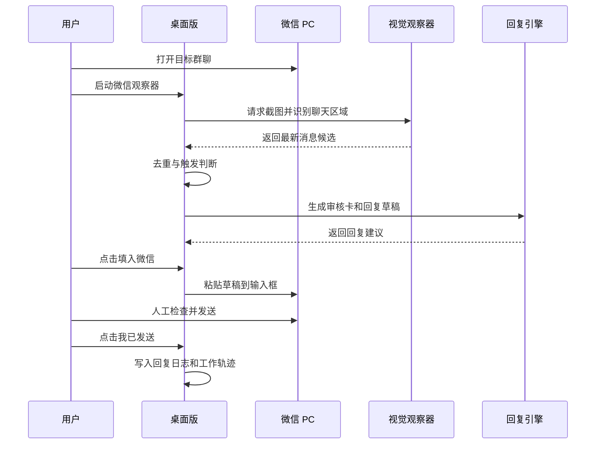
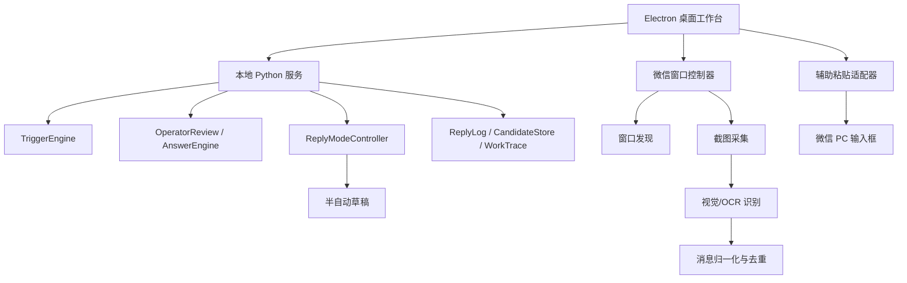

# 桌面版合并网页版与微信 PC 视觉半自动回复设计

## 状态

待用户评审。

## 日期

2026-07-02

## 背景

当前产品存在两个入口：

- Electron 桌面版：主要是轻量控制器，负责启动/停止本地服务、配置基础参数、打开高级页面。
- 本地网页版工作台：功能更完整，包含消息流、决策面板、监听配置、生成草稿、填入微信、确认发送、保存候选和工作轨迹。

这导致用户实际使用时需要在桌面版和网页版之间切换，桌面版没有承载完整工作流。同时，现有自动回复能力依赖 WeFlow 本地 API 轮询，无法直接观察微信 PC 客户端界面，也无法像视觉自动化产品那样基于屏幕内容生成和填入回复。

本次改造目标是把桌面版升级为唯一产品入口，并新增面向微信 PC 客户端的视觉半自动回复能力。

## 已确认产品边界

1. 桌面版合并网页版能力，用户只使用桌面版。
2. 网页版作为产品入口废弃，不再面向用户使用。
3. 第一版目标聊天客户端为微信 PC 客户端。
4. 自动回复模式采用半自动增强：
   - 自动观察微信窗口。
   - 自动识别新消息。
   - 自动生成回复草稿。
   - 自动填入微信输入框或复制到剪贴板。
   - 不自动点击发送，不自动按回车。
5. 用户人工检查后，在微信中手动发送，并在桌面版中点击“我已发送”完成记录。

## 目标

1. 桌面版提供完整工作台能力，不再需要打开网页版。
2. 复用现有本地 Python 服务、回复引擎、候选库和轨迹记录能力。
3. 新增微信 PC 视觉观察器，支持从屏幕截图识别最新聊天消息。
4. 新增视觉识别去重与安全降级，避免重复生成和误填。
5. 保持半自动安全边界，任何情况下第一版都不执行自动发送。
6. 为后续更强的 GUI Agent 能力保留模块边界，但不在第一版承诺无人值守。

## 非目标

1. 不破解微信数据库。
2. 不注入微信进程。
3. 不使用隐藏式 hook。
4. 不绕过微信客户端安全机制。
5. 不实现自动点击发送或自动按回车。
6. 不做多账号、多群批量营销。
7. 不把聊天截图或聊天原文直接写入事实 RAG 知识库。

## 用户体验

### 主窗口

桌面版主窗口升级为完整工作台，包含四个区域：

1. 左侧控制栏：
   - 微信 PC 状态。
   - 当前目标窗口标题。
   - 观察器启动/停止。
   - 群聊名称和关键词配置入口。
2. 中间消息流：
   - 展示从微信视觉识别或 WeFlow 导入得到的消息。
   - 标记“待处理”“建议回复”“转人工”“待补充”“已填入”“已发送”等状态。
3. 右侧决策面板：
   - 展示触发原因、命中关键词、回复来源、置信度、风险原因。
   - 展示视觉识别摘要和去重信息。
4. 底部回复区：
   - 展示回复草稿。
   - 支持人工编辑。
   - 提供“填入微信”“复制”“我已发送”“保存候选”等动作。

### 核心流程



## 总体架构



## 模块设计

### 1. 桌面工作台 UI

桌面工作台负责承载原网页版功能，并通过 Electron IPC 调用本地服务。

第一版应迁入这些能力：

- 加载演示数据。
- 导入/拉取消息。
- 展示消息流。
- 展示决策面板。
- 手动输入问题并生成草稿。
- 填入微信。
- 复制回复。
- 确认已发送。
- 保存候选。
- 查看工作轨迹。
- 配置微信监听参数。

网页版 HTML 可以保留为开发兼容层，但不再作为用户入口。启动脚本和 README 后续应引导用户打开桌面版。

### 2. 本地服务 API

现有 `workbench_server.py` 继续作为 Electron 后端，但 API 需要从“网页专用”整理为“桌面工作台 API”。

建议新增或稳定以下接口：

| 接口 | 用途 |
| --- | --- |
| `GET /api/items` | 获取消息流 |
| `POST /api/ask` | 手动问题生成草稿 |
| `POST /api/save-candidate` | 保存候选回复 |
| `POST /api/wechat/paste` | 将草稿填入微信或复制到剪贴板 |
| `POST /api/wechat/confirm-sent` | 记录人工已发送 |
| `GET /api/app/work-trace` | 获取工作轨迹 |
| `POST /api/vision/capture` | 捕获微信窗口截图并识别消息 |
| `POST /api/vision/start` | 启动视觉观察器 |
| `POST /api/vision/stop` | 停止视觉观察器 |
| `GET /api/vision/status` | 获取视觉观察状态 |

### 3. 微信窗口控制器

微信窗口控制器运行在桌面侧或 Python 侧，负责与 Windows 桌面环境交互。

职责：

- 查找微信 PC 主窗口。
- 获取前台窗口标题。
- 截取微信窗口区域。
- 在必要时将回复复制到剪贴板。
- 尝试向当前前台窗口发送 `Ctrl+V`。

安全约束：

- 不自动发送。
- 不点击发送按钮。
- 不按回车。
- 不操作非微信窗口，除非用户明确选择“任意前台窗口粘贴”。
- 当前窗口不是微信时，降级为复制到剪贴板并提示用户手动粘贴。

### 4. 视觉识别管线

视觉识别管线从截图中提取“最近可回复消息”。

第一版建议采用可替换接口：

```python
@dataclass(frozen=True)
class VisionMessage:
    message_id: str
    sender_alias: str
    content: str
    message_time: str
    region: dict[str, int]
    confidence: float
    source: str = "wechat_pc_vision"
```

接口：

```python
class WeChatVisionRecognizer:
    def recognize(self, screenshot: bytes) -> list[VisionMessage]:
        ...
```

可选实现顺序：

1. OCR 实现：先用本地 OCR 或可用 OCR 工具提取文本，成本低，便于测试。
2. 视觉模型实现：用多模态模型识别聊天消息、发送人和输入框区域。
3. 混合实现：OCR 提文本，视觉模型做区域和上下文判断。

第一版不把具体供应商写死，避免后续更换模型时影响业务层。

### 5. 消息归一化与去重

视觉识别结果需要转换为现有 `ChatEvent`：

```python
ChatEvent(
    event_id=hash_identifier(window_title + content + message_time + region),
    group_id_hash=hash_identifier(window_title),
    group_name=configured_group_name,
    sender_alias=vision_message.sender_alias,
    sender_role="student",
    message_time=vision_message.message_time,
    content=vision_message.content,
    raw_type="text",
    source="wechat_pc_vision",
)
```

去重规则：

- 同一窗口、相同文本、相近区域和相近时间视为同一消息。
- 已处理消息写入本地 `listener_state`。
- 识别置信度低于阈值时不生成草稿，只显示“需人工确认识别结果”。

### 6. 回复决策

继续复用现有链路：

1. `TriggerEngine` 判断是否需要处理。
2. `OperatorReview` 调用 `AnswerEngine` 生成审核卡。
3. `ReplyModeController` 输出半自动决策。
4. UI 展示草稿与原因。

本次改造后 `ReplyModeController` 在微信 PC 视觉模式下只能输出：

- `ignored`
- `draft`
- `escalate`
- `mark_pending`

不输出 `auto_send`。

### 7. 辅助填入

继续复用 `AssistedPasteAdapter`，但增加窗口校验：

1. 用户点击“填入微信”。
2. 系统检查前台窗口标题是否像微信窗口。
3. 如果是微信窗口，将回复写入剪贴板并发送 `Ctrl+V`。
4. 如果不是微信窗口，只复制到剪贴板并提示用户切回微信手动粘贴。
5. 操作结果写入 `ReplyLog` 和 `WorkTrace`。

### 8. 候选库和日志

保持现有策略：

- 人工修改过的回复进入 `data/reply_candidates.jsonl`。
- 发送确认和填入动作进入 `data/reply_logs.jsonl`。
- 视觉识别、回复生成、填入动作进入 `data/work_trace.jsonl`。

日志必须能区分：

- 来自 WeFlow 的消息。
- 来自微信 PC 视觉识别的消息。
- 复制到剪贴板。
- 已填入微信。
- 人工确认已发送。

## 错误处理

| 场景 | 处理 |
| --- | --- |
| 找不到微信窗口 | UI 显示未连接，观察器不启动 |
| 截图失败 | 记录错误，保留上一次状态 |
| 视觉识别为空 | 显示“未识别到新消息”，不生成草稿 |
| 识别置信度低 | 展示识别文本，要求人工确认 |
| 回复引擎无答案 | 标记待补充 |
| 前台窗口不是微信 | 只复制到剪贴板 |
| 粘贴失败 | 保留剪贴板内容并提示手动粘贴 |

## 安全策略

1. 第一版不自动发送。
2. 任何视觉识别不确定时，不自动填入。
3. 涉及个人报名状态、录取结果、作业答案/debug、安全、投诉的问题继续转人工。
4. 视觉截图默认不落盘；如需调试截图，必须放在本地数据目录并显式标记为调试文件。
5. 工作轨迹记录结构化摘要，不保存敏感原图。
6. 候选回复需要人工审核后才能进入正式 FAQ 或资料库。

## 分阶段实施

### 阶段一：桌面版合并网页版

- 将网页版工作台的数据获取、消息流、决策面板和回复动作迁入 Electron renderer。
- 扩展 preload 和 main IPC，覆盖原网页 API。
- 保留 Python 服务作为本地后端。
- 废弃用户可见网页版入口。

验收：

- 用户打开桌面版即可完成原网页版主要操作。
- 不需要访问 `http://127.0.0.1:8765`。

### 阶段二：微信 PC 辅助粘贴强化

- 增加微信窗口标题检测。
- 将“填入微信”变为带窗口校验的动作。
- 非微信窗口时自动降级为复制。
- 完善操作轨迹。

验收：

- 当前前台是微信时可以填入。
- 当前前台不是微信时不会误粘贴。

### 阶段三：微信 PC 视觉观察器 MVP

- 实现微信窗口截图。
- 实现第一版 OCR/视觉识别接口。
- 将识别结果转换为 `ChatEvent`。
- 接入触发、回复和去重链路。

验收：

- 用户打开微信 PC 群聊后，桌面版能识别最新文本消息。
- 新消息能生成草稿。
- 重复截图不会重复生成同一条回复。

### 阶段四：视觉质量与可观测性

- 增加识别置信度展示。
- 增加识别失败原因。
- 增加视觉模式工作轨迹。
- 增加测试样例和回放数据。

验收：

- 能复盘一条视觉消息从识别到填入的完整链路。
- 低置信识别不会进入自动填入。

## 测试策略

1. 桌面 API 测试：覆盖消息列表、生成草稿、保存候选、确认发送。
2. Renderer 静态测试：覆盖主要按钮和 IPC 调用是否存在。
3. 视觉识别单元测试：用固定截图或模拟识别器验证 `VisionMessage` 转 `ChatEvent`。
4. 去重测试：相同文本和区域不会重复入队。
5. 安全测试：微信窗口不存在、非微信前台、低置信识别都不会自动粘贴。
6. 端到端手工验证：打开微信 PC，识别消息，生成草稿，填入输入框，人工发送并确认。

## 验收标准

1. 桌面版具备原网页版主要工作台能力。
2. 用户无需打开网页版即可完成消息处理。
3. 桌面版能面向微信 PC 客户端执行半自动增强流程。
4. 系统不会自动发送消息。
5. 识别到的新消息能进入现有回复引擎。
6. 回复草稿可被自动填入微信输入框或复制到剪贴板。
7. 用户人工发送后可以记录“我已发送”。
8. 候选库、回复日志和工作轨迹能区分视觉模式来源。

## 待后续评估

1. 具体视觉模型或 OCR 供应商选择。
2. 是否需要用户手动框选微信聊天区域。
3. 是否需要多群窗口并行观察。
4. 是否需要调试截图留存开关。
5. 是否将视觉识别样例沉淀为回归测试集。
