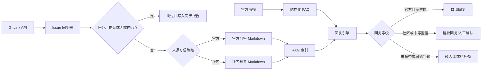

# GitLink Issue RAG 与夏令营回复逻辑调整设计

## 1. 背景

当前智能体已经具备“结构化 FAQ 优先、RAG 兜底、敏感问题转人工”的回复链路，但知识内容和 RAG 使用方式存在以下缺口：

1. 结构化 FAQ 仍包含旧报名入口，线上学习与作业时间也未更新到最新海报口径。
2. 两个课程仓库中的 Issue 已沉淀 FAQ、技术问题和答复，但尚未进入事实 RAG。
3. Issue 中同时存在任务说明、打卡、作业提交、学生自述方案和官方答复，不能不加区分地用于自动回复。
4. 当前 RAG 主要根据相似度决定是否自动回复，缺少来源可信等级约束。
5. GitLink 内容仍会继续变化，需要可重复运行的同步能力，而不是一次性复制。

本次调整覆盖以下来源：

- `https://www.gitlink.org.cn/metax-maca/op_optimization/issues`
- `https://www.gitlink.org.cn/ccf-ai-infra/Intro-ops/issues`
- 用户提供的首届开源英才夏令营官方咨询群海报内容。

## 2. 目标

1. 将最新海报中的报名、课程、作业、直播、面试和线下营期信息更新为结构化 FAQ。
2. 提供可重复运行的 GitLink Issue 同步命令，通过公开 API 获取最新内容。
3. 排除任务、打卡、作业提交、纯赛题说明、无有效答复和不适合作为事实依据的内容。
4. 将有效 Issue 问答按“官方”和“社区参考”分层写入 RAG 文档。
5. 官方高置信内容可以直接回复；社区经验只能生成待确认的建议回复。
6. 保留个人状态、作业代答、安全和投诉问题优先转人工的现有边界。
7. 同步失败时保留上一次成功快照，避免破坏可用知识库。

## 3. 非目标

本次不实现以下内容：

- 不在每次学生提问时实时访问 GitLink。
- 不自动判断个人报名、作业提交、成绩、面试或录取状态。
- 不把学生作业代码、截图、用户名、邮箱等内容写入事实 RAG。
- 不让智能体代写作业、直接调试参赛代码或裁定评分争议。
- 不自动向 GitLink 写入、回复或修改 Issue。
- 不引入复杂的后台审核系统；本次通过配置、同步报告和已有建议回复流程完成人工复核。

## 4. 方案选择

### 4.1 候选方案

#### 方案 A：原样同步所有非任务 Issue

优点是实现简单、覆盖内容多。缺点是学生提交、自述方案、未确认回复和过期讨论会直接污染事实库，不适合自动回复。

#### 方案 B：分层可信同步

同步时同时执行内容过滤和可信度分层：官方海报、官方 FAQ、可信维护者答复作为官方来源；普通用户提供的已解决经验作为社区参考。官方内容允许在高置信时自动回复，社区内容只能生成建议回复。

#### 方案 C：回答时实时查询 GitLink

内容最及时，但回答延迟、网络可用性和页面/API 变化都会直接影响学生咨询，且难以在发送前稳定执行内容过滤。

### 4.2 选择结论

采用方案 B。该方案兼顾时效性、可追溯性和回复安全，适合当前本地智能体与人工确认流程。

## 5. 总体架构



## 6. 数据来源与优先级

回复事实的优先级从高到低为：

1. 用户提供的最新官方海报和后续正式群公告。
2. GitLink 中明确整理的官方 FAQ。
3. GitLink Issue 中可信维护者或组织者的明确答复。
4. 普通用户提供、且已明确说明问题已解决的社区经验。

发生冲突时采用更高优先级且更新时间更晚的来源。社区经验不得覆盖官方内容。

## 7. 海报知识更新

`data/faq.json` 中新增或更新以下确定信息：

| 主题 | 最新口径 |
| --- | --- |
| 报名时间 | 即日起至 2026 年 7 月 15 日 |
| 报名入口 | `https://developer.metax-tech.com/activities/18` |
| 报名姓名 | 填写真实姓名，便于接收报名通知 |
| 线上学习与作业 | 即日起至 2026 年 7 月 20 日 |
| 课程 1 | TileLang 入门学习，仓库为 `ccf-ai-infra/Intro-ops`，作业 Issue 为 #16 |
| 课程 2 | 真实算子优化实战，仓库为 `metax-maca/op_optimization`，作业 Issue 为 #12 |
| 提交账号 | 以邮件形式发送到报名邮箱 |
| 线上直播 | 2026 年 7 月 13 日至 7 月 15 日，每晚 19:00—21:00 |
| 面试与入营通知 | 预计 2026 年 7 月下旬，综合报名材料、学习情况、作业质量和面试表现确定 |
| 线下夏令营 | 2026 年 8 月 3 日至 8 月 7 日，地点为上海交通大学、沐曦股份 |
| 群昵称 | 建议修改为“姓名-学校-年级” |

旧报名链接 `https://v.wjx.cn/vm/r9BqUzR.aspx#` 不再作为有效回复来源。

报名入口和截止时间条目增加可选的 `expired_answer`：报名截止后仍应明确告知“报名已于 2026 年 7 月 15 日截止”，并提供最新报名入口供用户核对已提交信息，不能退化为“当前资料未说明”。未配置 `expired_answer` 的其他过期条目继续按原安全策略停止自动回复。

## 8. GitLink 同步器

### 8.1 配置

新增 `data/gitlink_rag_sources.json`，每个仓库配置以下内容：

- 仓库拥有者和仓库标识。
- Issue 列表及详情 API 地址所需参数。
- 排除标签，首版包含“任务”。
- 排除标题模式，首版覆盖“任务”“打卡”“作业提交”等提交型内容。
- 可信答复账号列表。
- 来源名称和默认可信等级。

可信账号必须显式配置，不根据单条评论内容自动推断为官方人员。配置变更需要代码审阅或运营复核。

### 8.2 拉取流程

同步命令执行以下步骤：

1. 分页读取仓库 Issue 列表。
2. 拉取候选 Issue 的详情和评论。
3. 应用标签、标题、内容类型和有效答复过滤。
4. 清理操作日志、空评论、图片附件、作业截图、用户名和明显的提交模板。
5. 将官方 FAQ 表格拆分为独立问答。
6. 将普通 Issue 的标题/正文识别为问题，将有效评论识别为答复。
7. 根据答复账号和来源类型写入 `official` 或 `community` 可信等级。
8. 在临时目录生成全部 Markdown 和同步报告。
9. 全部请求和校验成功后，再替换生成目录中的旧快照。

### 8.3 排除规则

满足任一条件的 Issue 不进入 RAG：

- 包含“任务”标签。
- 标题命中任务、打卡、作业提交等排除模式。
- 内容本质为赛题任务说明、学生成果提交或截图集合，而不是问答。
- 没有可用答复。
- 只有问题反馈，但官方仍在排查且没有可执行结论。
- 内容包含个人敏感信息，且无法安全清理。
- 内容属于个人成绩、报名状态、录取结果或评分争议。

标题中出现“赛题”不直接等于排除。若内容是明确问题且存在可信答复，仍可纳入；纯赛题说明则排除。

### 8.4 社区经验规则

普通用户自述的解决方案只有同时满足以下条件才可作为社区参考：

- 明确描述了问题现象和解决步骤。
- 作者明确说明问题已解决，或提供可验证的完成结果。
- 不涉及作业答案、评分绕过、榜单规避或其他不当竞赛帮助。
- 不包含个人信息或大段提交代码。

社区经验不会升级为官方来源，除非后续由可信账号明确确认。

### 8.5 生成文件

每条有效问答生成独立 Markdown，写入：

`data/rag/documents/gitlink-issues/<owner>/<repo>/issue-<index>-<slug>.md`

文档使用 YAML front matter 保存：

```yaml
source_type: gitlink_issue
trust_level: official
source_url: https://www.gitlink.org.cn/example/repo/issues/1
source_updated_at: 2026-07-20 12:00
repository: example/repo
issue_index: "1"
answer_author: organizer
```

正文结构为：

```markdown
# 问题标题

直接可复用的答复正文。
```

正文不重复问题描述和讨论过程，避免现有 RAG 回复器把整段讨论原样发送给学生。

## 9. RAG 文档与索引调整

`summer_camp_agent/rag_documents.py` 增加 YAML front matter 读取能力：

- 元数据写入 `DocumentChunk.metadata`。
- front matter 本身不进入向量文本和回复正文。
- 非法或不支持的可信等级触发校验错误，不静默降级为官方内容。

索引继续使用现有 `metadata` 字段持久化，不修改索引文件整体结构版本。旧文档没有可信等级时按现有正式资料处理；GitLink 生成目录中的文档必须声明可信等级。

## 10. 回复逻辑调整

回复顺序保持为：

1. 敏感问题和必须转人工的问题。
2. 结构化 FAQ。
3. RAG 文档。
4. 未命中回复。

结构化 FAQ 命中后，未过期时使用 `answer`；已过期且存在 `expired_answer` 时使用明确的历史状态答复；已过期且没有 `expired_answer` 时继续检索 RAG，仍未命中则返回未命中回复。

RAG 命中后增加来源可信等级判断：

- `official` 且达到强匹配阈值：`auto_reply`。
- `official` 但只达到最低匹配阈值：`suggested_reply`。
- `community`：无论相似度多高均为 `suggested_reply`。
- 来源元数据异常：不回答，返回 `needs_info` 并记录原因。

社区建议回复需要明确表示这是社区经验，并附 GitLink Issue 来源，提醒以课程助教或后续官方答复为准。官方答复保留现有来源说明和“后续通知更新时以后续通知为准”的边界提示。

## 11. 同步报告与可观测性

每次同步生成中文报告，至少包含：

- 同步时间。
- 每个仓库抓取的 Issue 数量。
- 因任务标签跳过的数量。
- 因标题或内容类型跳过的数量。
- 因无有效答复跳过的数量。
- 生成的官方问答数量。
- 生成的社区参考数量。
- 异常 Issue 编号及原因。

报告写入生成目录外的固定文件，便于在替换快照前后比较。日志和报告不得包含学生个人信息或完整作业内容。

## 12. 异常处理

- 网络超时、分页失败、API 返回非预期结构时，同步命令失败退出。
- 任一仓库未完成全部分页时，不替换该次快照。
- 单个 Issue 格式异常时允许跳过，但必须在报告中记录 Issue URL 和原因。
- 生成文档未通过格式、来源 URL 或可信等级校验时，不替换旧快照。
- 写入采用临时目录加最终替换，避免生成一半的知识库。
- RAG 索引仍由现有 `rag-index` 命令显式重建；同步器不在索引失败时删除旧索引。

## 13. 测试策略

### 13.1 同步器测试

- 正确处理 GitLink 分页列表、Issue 详情和评论。
- 排除“任务”标签。
- 排除标题中的任务、打卡和作业提交模式。
- 区分纯赛题说明与有明确答复的赛题问题。
- 跳过无有效答复的 Issue。
- 拆分官方 FAQ 表格为独立问答。
- 清理图片附件、空操作日志、用户名和提交模板。
- 正确标记官方与社区可信等级。
- API 失败时不覆盖旧快照。
- 生成同步统计和异常明细。

### 13.2 RAG 测试

- front matter 元数据进入 chunk，但不进入正文。
- 非法可信等级被拒绝。
- 官方强匹配产生 `auto_reply`。
- 官方中等匹配产生 `suggested_reply`。
- 社区强匹配仍只能产生 `suggested_reply`。
- 来源 URL 能出现在来源说明中。

### 13.3 海报 FAQ 与回复边界测试

- 最新报名入口能够命中，旧报名入口不再出现。
- 2026 年 7 月 20 日作业截止时间能够命中。
- 2026 年 7 月 13 日至 15 日、每天 19:00—21:00 的直播信息能够命中。
- 课程 1、课程 2 及对应作业 Issue 能够命中。
- 2026 年 8 月 3 日至 7 日线下营期与地点能够命中。
- 个人录取查询、作业代答和安全投诉仍优先转人工。

## 14. 验收标准

1. 可通过单条命令重新同步两个 GitLink 仓库。
2. 同步报告能清楚说明纳入和排除结果。
3. #12、#16 以及其他任务、打卡、作业提交内容不出现在生成文档中。
4. 官方 FAQ 被拆成可独立检索和直接回答的短问答。
5. 社区经验永远不会触发自动发送。
6. 海报中的最新时间、入口和课程信息能够正确回答。
7. 旧报名链接不再由知识库返回。
8. 同步失败不会破坏上一次成功快照。
9. 单元测试、知识库校验和静态 RAG 建索引全部通过。
10. 使用代表性报名、课程、技术、社区经验、个人状态和作业代答问题完成端到端验证。

## 15. 实施边界与后续维护

- 首次实施时根据当前 Issue 中明确的组织者与维护者账号初始化可信账号配置，并在同步报告中列出实际命中的账号。
- 新增可信账号必须人工确认，不能仅因为某条回复措辞正式就自动加入。
- 海报或群公告更新后，先更新结构化 FAQ，再重新同步和建索引。
- GitLink API 字段或分页方式变化时，同步器应显式失败并提示维护，不能自动退化为抓取网页正文。
- 若未来需要自动定时同步，应另行设计调度、审核和索引切换流程，本次只提供人工执行的可重复命令。
