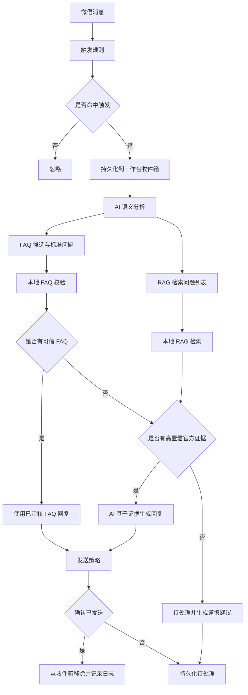

# AI 语义路由与持久化待处理队列设计

## 背景与问题

工作台当前采用“触发判断 → FAQ 字面匹配 → 本地 RAG 字符相似度 → 回复决策”的处理链路。三个现场问题的复现结果如下：

| 学生问题 | FAQ 最高分 | RAG 最高分 | 当前决策 |
|---|---:|---:|---|
| XPUOJ 测评 MoE 耗时减少了但是分数反而降低了？ | 0.00 | 0.326 | `needs_info` |
| 夏令营期间我碰到问题该找谁处理？ | 0.50 | 0.20 | `needs_info` |
| 线下夏令营在哪？ | 0.90 | 0.293 | FAQ 自动回复 |

前两个问题都包含问号，因此已命中触发规则，并在工作轨迹中产生 `mark_pending` 决策。它们没有稳定显示在待处理队列中的根因是：

1. `WorkbenchApiState.items` 只保存在进程内存。
2. 监听器在读取消息后立即把事件 ID 写入 `listener_state.json` 的 `seen_event_ids`。
3. 应用重启后内存队列清空，但监听器默认跳过已看事件。
4. 手动回捞虽然允许包含已看事件，但只查询最近一小时；超过一小时后无法恢复。
5. 已自动回复的问题会进入 `replied_event_ids`，按设计不再进入待处理队列。

因此需要同时解决两个问题：用 AI 理解自然语言语义，以及持久化所有尚未确认回复的工作台消息。

## 目标

1. 所有命中触发规则的消息先经过 AI 语义识别，再使用 FAQ 和 RAG 取证。
2. AI 只负责识别意图、改写检索问题和给出候选项，不直接绕过知识库回答。
3. 工作台展示 AI 语义置信度、FAQ 匹配分和 RAG 匹配分，避免用单一分数混淆不同阶段。
4. 未回复消息在应用重启、监听暂停和超过一小时后仍保留在待处理队列。
5. AI 不可用时安全降级到现有本地链路；未命中消息仍然持久化，不得丢失。
6. 对三个现场问题建立可重复的自动化验收场景。

## 非目标

- 不把全部 FAQ 正文和全部 RAG 文档一次性发送给模型。
- 不允许模型返回知识库之外的新日期、规则、联系人或链接。
- 不降低现有 RAG 全局阈值来换取更多命中。
- 不清空或重写现有 `listener_state.json`。
- 不在验证过程中向真实微信群发送消息。

## 方案选择

采用“AI 语义路由 + 本地知识取证”的两阶段方案。

未采用的方案：

- 全量知识直接交给 AI：上下文大、成本高，且难以解释具体引用了哪条资料。
- 仅增加向量检索：可以改善相似问题召回，但不满足“AI 先识别语义”，也无法明确区分意图判断和证据置信度。

## 总体数据流



## AI 语义分析器

新增独立的 `SemanticAnalyzer` 接口。OpenAI 实现继续使用 Responses API 和严格 JSON Schema 结构化输出。

输入：

- 学生原始问题。
- FAQ 的 `id`、`intent`、问题和同义问法组成的紧凑目录。
- 允许的语义类别和安全边界。

输出：

```yaml
status: analyzed | unavailable | invalid
canonical_question: string
intent: string
faq_candidate_ids: [string]
rag_queries: [string]
semantic_confidence: 0.0-1.0
requires_human: boolean
reason: string
model: string
error: string
```

约束：

- `faq_candidate_ids` 必须存在于当前 FAQ 目录，未知 ID 视为无效。
- `rag_queries` 最多三条，每条限制长度，不允许包含指令或回答内容。
- AI 语义结果只影响检索路线，不能直接成为回复正文。
- `semantic_confidence` 不替代 FAQ/RAG 证据分。
- AI 不可用、超时、配额不足或输出无效时，使用原问题执行现有本地检索。

## FAQ 与 RAG 取证

### FAQ

检索顺序：

1. 校验 AI 给出的 FAQ 候选 ID。
2. AI 语义置信度达到 0.80 且候选唯一时，允许把该 FAQ 作为语义命中。
3. 否则继续使用现有字面匹配分。
4. FAQ 必须仍满足有效期、`auto_reply` 和人工升级规则。

工作台分别记录：

- `semantic_confidence`
- `faq_confidence`
- 最终采用的 `confidence`

### RAG

使用原问题、`canonical_question` 和 `rag_queries` 分别检索，按文档块去重后选择最高分结果。保留现有阈值：

- 最低返回阈值：0.72
- 官方资料强命中阈值：0.82
- 社区资料永远不标记为强命中

工作台额外记录 `rag_confidence` 和实际采用的检索问题。

### 回答生成

- FAQ 命中：直接使用已审核 FAQ，不再让 AI 改写事实。
- 官方 RAG 强命中：让 AI 仅根据命中文档生成自然语言回复。
- AI 服务不可用：允许降级为官方 RAG 原文。
- AI 明确判断证据不足（`not_grounded`）：不得把原文当成完整答案自动发送，改为待处理并生成“当前资料能确认什么、不能确认什么、应找谁核实”的谨慎建议。
- 社区资料或低置信资料：仅作为待处理参考，不自动发送。

## 持久化工作台收件箱

新增本地 JSONL 收件箱，默认路径为 `data/workbench_inbox.jsonl`，并加入 `.gitignore`。

收件箱只保存已经脱敏的 `ChatEvent`，不保存微信 Token、原始账号 ID 或其他未脱敏字段。

状态规则：

1. 监听器产生事件后，先写入收件箱，再执行回答决策和发送。
2. 自动发送成功或运营确认已发送后，从收件箱移除。
3. `mark_pending`、`draft`、`escalate`、发送失败和仅复制到剪贴板的消息继续保留。
4. 应用启动时加载收件箱并重新执行当前 FAQ/RAG/语义决策，但不自动发送历史恢复项。
5. 事件 ID 去重，避免后台轮询和手动刷新产生重复卡片。
6. 使用临时文件替换保证更新过程不会留下半行 JSON。
7. 收件箱最多保留最近 500 条未回复事件。

## 工作台展示

详情区增加：

- AI 语义：意图、标准问题、模型、状态。
- AI 语义置信度。
- FAQ 匹配分。
- RAG 匹配分。
- 实际采用的 RAG 检索问题。
- 降级或进入待处理的明确原因。

列表状态继续使用“待处理、草稿、待人工、已回复”等非技术文案，不向普通用户暴露内部异常堆栈。

## 三个验收场景

### 1. XPUOJ 评分异常

预期语义：`evaluation.scoring` 或等价技术评测意图。

现有资料只能确认正式结果以 XPUOJ 为准，不能确认“耗时下降但分数下降”的具体原因。因此应进入待处理队列，并给出谨慎建议：

> 当前资料只能确认赛题一 MoE 的正式排名与初筛以 XPUOJ 平台评测结果为准，现有 FAQ 和 RAG 没有说明耗时下降但分数降低的具体评分原因。建议保留提交版本、评测记录和各项指标，通过 GitLink Issue 或答疑群联系课程助教核查正确性、计分维度和评测环境。

不得声称已经确定是正确性、精度或环境问题。

### 2. 遇到问题找谁

预期语义：`support.contact`。

AI 应将 RAG 查询改写为“赛题问题应通过什么渠道提问、联系谁”，命中官方 GitLink FAQ。回复应说明优先使用 GitLink Issue 和赛事答疑群；进一步沟通按比赛方案联系赛事负责人。若具体联系方式不在当前证据中，不得自行补充电话号码或账号。

### 3. 线下夏令营地点

预期语义：`offline.location`。

AI 应选择 FAQ `faq.offline.location`，回复：

> 线下夏令营时间为 2026 年 8 月 3 日至 8 月 7 日，地点为上海交通大学、沐曦股份。具体报到地点和每日场地以最终入营通知为准。

## 测试与验证

### 测试驱动实现

先编写并观察以下测试失败：

1. 两个低字面相似度问题可通过语义分析得到正确候选和检索问题。
2. AI 给出未知 FAQ ID、过低置信度或危险检索文本时被拒绝。
3. AI 不可用时回退本地检索，消息仍进入收件箱。
4. 未回复事件在创建新 `WorkbenchApiState` 后恢复。
5. 已确认回复事件从收件箱删除且不会恢复。
6. 三个现场问题完成预期决策和建议回复。
7. 真实 OpenAI 配额不足时记录 `insufficient_quota`，不丢消息、不误报 AI 成功。

### 完成前验证

- 运行全部 Python 单元测试。
- 运行桌面端静态测试、类型检查和生产构建。
- 使用模拟微信监听与发送适配器，逐条验证三个现场问题。
- 重建工作台状态，验证待处理项仍存在。
- 执行真实 OpenAI 冒烟验证；若账户仍返回 `insufficient_quota`，明确记录外部阻塞，并以结构化假实现验证语义链路，不把模拟结果描述为真实模型结果。
- 检查差异格式和疑似密钥。

## 风险与边界

- AI 语义置信度是模型判断，不是事实可信度，必须和 FAQ/RAG 证据分分开显示。
- 当前 OpenAI API Key 存在配额不足问题；代码可完成并通过模拟验证，但真实模型验收取决于账户额度恢复。
- 恢复历史收件箱时不自动发送，避免应用崩溃发生在“实际已发送、状态尚未写入”之间导致重复回复。
- 技术评测争议默认保守处理；缺少明确评分规则时进入待处理队列，不自动推断原因。
