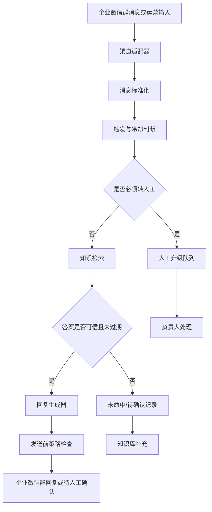

# 技术架构草案

## 目标

第一版要先证明两件事：

1. 基于官方资料能否稳定回答学生高频问题。
2. 在企业微信群场景下，回复、转人工、未命中沉淀是否不会打扰正常沟通。

因此技术上建议先做“可本地验证的问答内核 + 可替换的企业微信适配层”，不要一开始把业务逻辑绑死在某一种企业微信接入方式上。

## 接入方式判断

企业微信群机器人 webhook 通常更适合“向群里发送消息”，例如主动提醒、人工审核后推送 FAQ、每日通知等。它未必等价于“能读取群内学生消息并自动回复”。如果要做真正的群内自动回复，需要在开发前确认企业微信官方支持的接收消息方式，例如自建应用消息回调、群聊机器人能力、会话内容存档或其他合规接口。

因此第一版实现应分两层：

- **问答内核**：独立于企业微信，负责意图识别、知识检索、回答生成、升级判断、冷却去重和日志。
- **渠道适配器**：负责接收企业微信消息、发送群回复、推送人工升级、接收运营确认。

如果接收群消息能力暂时无法确认，仍然可以先交付一个“运营可用版本”：学生问题由运营复制到测试入口或后台，agent 给出建议回复；确认后再通过群机器人 webhook 发到群里。

## 推荐架构



## 核心模块

### 1. 渠道适配器

职责：

- 接收群消息、被 @ 消息或运营手动输入。
- 统一成内部消息格式。
- 调用问答内核。
- 将自动回复、人工升级或待确认结果送回企业微信或运营后台。

第一版建议保留多个实现：

- `manual`：本地命令行或简单网页表单，用于验证 FAQ 和策略。
- `wecom_webhook_outbound`：只负责向群里发主动提醒或人工确认后的消息。
- `wecom_interactive`：等官方接收消息方案确认后再实现。

### 2. 消息标准化

内部消息建议字段：

```yaml
message_id: string
channel: enterprise_wechat | manual
group_id: string
sender_role: student | organizer | mentor | unknown
text: string
mentioned_agent: boolean
created_at: datetime
context_messages: []
```

### 3. 策略引擎

职责：

- 判断是否被 @ 或命中高置信关键词。
- 执行同群同意图冷却规则。
- 在检索前先拦截必须转人工的问题。
- 在发送前检查是否包含未确认承诺、个人状态、过期信息或作业代答倾向。

### 4. 知识检索

第一版可以先用结构化 FAQ，不急着上复杂向量库。每条 FAQ 保留 `stage`、`intent`、`question_aliases`、`answer`、`source`、`source_date`、`valid_until`、`auto_reply` 等字段。

推荐顺序：

1. 精确意图或关键词匹配。
2. 同义问法匹配。
3. 简单语义检索。
4. 低置信时转未命中，不强答。

### 5. 回复生成器

回复必须使用可追溯资料生成，默认结构：

```text
同学你好，[直接答案]

[下一步行动]

[必要边界提示]
```

禁止：

- 编造未发布安排。
- 承诺“已记录”，除非日志系统确认写入成功。
- 查询或暗示个人录取/面试结果。
- 代写作业、给出评分争议结论。

### 6. 人工升级队列

升级记录建议字段：

```yaml
ticket_id: string
original_question: string
group_id: string
created_at: datetime
reason: personal_status | safety | complaint | technical_assignment | stale_source | unknown
urgency: normal | same_day | immediate
suggested_owner: 运营 | 招生负责人 | 课程助教 | 现场保障负责人
candidate_sources: []
status: open | resolved | added_to_kb | ignored
```

## 首版技术路径

### 第一步：本地可验证问答内核

不接企业微信，先把 `seed-faq.md` 转成结构化知识条目，做一个本地问答入口。目标是验证：问 20-30 个学生常见问题时，系统能答的就答，不能答的稳稳拒绝并标记待补充。

### 第二步：运营半自动模式

增加一个人工确认流程：agent 生成建议回复，运营确认后再发到群里。这个阶段可以用企业微信群 webhook 做出站推送，但不假设它能接收群消息。

### 第三步：企业微信互动模式

确认官方接收消息能力后，再实现企业微信互动适配器。所有业务规则仍走同一个问答内核，避免后续换接入方式时重写核心逻辑。

## 待官方确认

- 企业微信群机器人是否支持接收群成员消息或被 @ 事件。
- 自建应用是否能在目标群聊场景中接收学生提问并回复到群。
- 如果使用会话内容存档，是否满足企业合规、授权、费用和隐私要求。
- 群机器人 webhook 的消息类型、频率限制、失败重试和安全签名规则。
- 主动提醒是否需要运营人工确认后发送。

## 微信 FAQ、RAG 与 AI 回复链路

当前微信工作台采用以下固定顺序处理消息：

1. 医疗安全、投诉、个人录取状态和作业代写等必须人工处理的问题先执行硬规则拦截，不发送给外部 AI。
2. 其余问题先由 AI 识别标准问题、意图、FAQ 候选、RAG 候选和检索改写。
3. 发送给语义分析器的知识目录只包含 FAQ 问题与别名，以及 RAG 文档块的 ID、可信级别和标题，不包含 RAG 正文。
4. 系统只接受目录中真实存在的唯一候选，并分别按 FAQ 和 RAG 语义阈值校验；AI 不能直接提供事实答案。
5. FAQ 候选通过校验时直接使用已审核答案；否则由本地 RAG 对 AI 选择的官方文档块重新取证。
6. 只有高置信且标记为 `official` 的 RAG 证据才交给 DeepSeek V4 生成自然语言回复。
7. AI 生成内容仍需通过依据性、长度和链接检查；未通过时使用带核查提示的 RAG 保守回复。
8. 正式自动模式下，只要 FAQ 或 RAG 返回了带来源的可用回复就直接发送；只有 FAQ 和 RAG 都未命中才进入持久化待处理队列。`community` 回复会保留“社区经验、需以后续官方答复为准”的提示。
9. 旧问号、关键词和 `@Agent` 触发结果继续记录为诊断信息，但不再阻止正式自动模式查询 FAQ/RAG；半自动模式仍保留旧触发过滤。

回复日志和工作台详情会记录：

- `generation_mode`：`faq`、`rag_ai`、`rag_fallback`、`rag_insufficient`、`rag_community`、`needs_info` 或 `human_fallback`。
- `generation_model`：实际配置的 AI 模型。
- `generation_error`：安全化后的降级原因，例如 `timeout`、`insufficient_quota`、`unsupported_url`。
- `semantic_confidence`：AI 对语义归一化与目录候选选择的置信度，不代表资料本身正确。
- `faq_confidence`：原始问题与 FAQ 问题、别名和关键词的本地词面匹配分。
- `rag_confidence`：原始问题与最终选中文档块的本地词面匹配分；AI 语义选中资料时，该分数可以较低。
- `semantic_status`、`semantic_intent`、`semantic_question`、`semantic_model` 和 `semantic_error`：用于解释语义识别结果及降级原因。

### 降级边界

- 语义分析或回答生成服务超时、网络不可用、配额不足时，系统保留原有本地 FAQ/RAG 能力；高置信官方 RAG 可以降级使用已审核的官方原文。
- AI 返回 `not_grounded` 表示已有资料与问题相关，但资料不足以支持具体结论。系统会生成“已确认事实 + 尚未说明部分 + 核查渠道”的保守回复并标记为 `rag_insufficient`；在正式自动模式下该 RAG 命中会直接发送。
- AI 返回未知候选 ID、多个候选、危险检索改写或越界字段时，语义结果作废并回退本地检索。

### SQLite 消息主存储

工作台消息以 `data/workbench_messages.sqlite3` 为唯一状态来源，`event_id`
同时作为消息唯一主键。数据库保存原始事件、触发判断、审核卡、回复决策和处理结果的
完整快照。相同 `event_id` 重复到达时不会新建记录，也不会把已经处理的消息重置成
待审核。

消息状态拆成两个相互独立的维度：

- `review_status`：`pending_review`、`sent`、`escalated`、
  `candidate_saved`、`review_completed`。
- `match_status`：`matched` 或 `unmatched`，只说明消息是否命中旧触发规则，
  不决定消息是否进入审核。

处理动作成功后直接更新同一主键记录：

- 自动发送成功或“我已发送”更新为 `sent`。
- 保存候选更新为 `candidate_saved`。
- 转人工更新为 `escalated`。
- 无需继续处理时更新为 `review_completed`。
- 仅填入微信不代表已经发送，仍保持 `pending_review`。

自动发送返回成功后，系统优先提交 SQLite 的 `sent` 状态并将消息移出待审核列表，
再写回复日志。回复日志属于附属审计记录，即使日志文件暂时写入失败，也不能把已经发送
的消息保留为 `pending_review`，以免重复回复。

待审核列表只查询 `pending_review`；历史记录从同一数据库读取。应用重启时直接恢复
持久化快照，不重新调用语义分析、FAQ、RAG 或回答生成服务。

### 调试审核模式

`debug_review_mode` 默认开启。该模式只接收目标群中其他成员发送的文本消息，仍排除
自己发送、系统事件、非文本和回复回环消息。所有收到的文本都进入待审核：

1. 命中旧问号、常用疑问词、关键词或 @ 规则时记录 `match_status=matched`。
2. 未命中时记录 `match_status=unmatched`，并说明缺少问号、常用疑问词、配置关键词
   和 @ 助手中的哪些信号。
3. 无论 FAQ 或官方 RAG 置信度多高，回复决策都强制为人工审核草稿。
4. 调试模式禁止自动发布；运营只能填入微信、确认已发送、保存候选、转人工或完成审核。
5. 人工启动观察或刷新时，会重新拉取最近窗口内曾被旧版监听状态误标为“已回复”的文本，
   再由 SQLite 按 `event_id` 核对去重；后台轮询和正式模式仍跳过真正已回复的消息。

常用疑问词作为独立的 `question_word` 触发原因，覆盖原因、内容、方法、地点、时间、
数量、人员、判断、许可、选择、状态和口语问法，例如“为什么”“什么”“怎么”“如何”
“哪里”“什么时候”“多少”“找谁”“是否”“能否”“要不要”“怎么样”“咋办”和
“有啥”。“没什么问题”“没事了”“不用了”“收到”“知道了”等明确无需回复的完整
表达会被排除；如果同一条消息后面仍包含实际问题，例如“没什么问题，不过怎么联系老师”，
仍按疑问词触发。

每条审核记录展示四类分数：

- `confidence`：本次回答卡采用的综合置信度。
- `semantic_confidence`：AI 对语义归一化和知识候选选择的置信度。
- `faq_confidence`：本地 FAQ 词面匹配分。
- `rag_confidence`：本地 RAG 文档块词面匹配分。

正式运行时关闭 `debug_review_mode` 后，自动模式会分析全部新消息：FAQ 或 RAG 任一命中即自动发送，两者都未命中则保留为待审核。调试模式仍强制所有消息进入待审核并禁止自动发送。

### 旧 JSONL 迁移与本地数据边界

首次启动 SQLite 版本时，系统会读取旧
`data/workbench_inbox.jsonl`，逐条按 `event_id` 幂等迁移，并在 SQLite 元数据表写入
迁移完成标记。后续启动不再重复迁移，也不会修改或删除旧 JSONL，便于人工核对和回滚。

SQLite 数据库、WAL/SHM 文件、旧收件箱、回复日志和聊天导入资料都属于本地运行数据，
不得提交到 Git、同步到公共网盘或写入项目文档。仓库忽略规则已覆盖这些文件。

### DeepSeek V4 配置

服务启动时从环境变量读取配置：

```text
OPENAI_API_KEY=DeepSeek API Key，必填
OPENAI_CHAT_MODEL=deepseek-v4-pro
OPENAI_BASE_URL=https://api.deepseek.com
```

为兼容现有启动脚本，配置键继续沿用 `OPENAI_*` 名称。`OPENAI_CHAT_MODEL` 和
`OPENAI_BASE_URL` 可省略，分别使用上面的 DeepSeek V4 默认值。聊天请求使用
`/chat/completions`、JSON Output 和非思考模式；API Key 不写入仓库、候选记录或回复日志。

可执行以下命令进行真实 AI、模拟微信收发的闭环验证：

```text
python -m scripts.verify_rag_ai_reply
```

该脚本不会操作真实微信窗口。验证成功时，三个官方 RAG 场景都应显示
`generation_mode=rag_ai` 并完成模拟自动发送；如果 DeepSeek 不可用，脚本会失败并报告
安全化原因，业务运行时仍会按上述规则降级回复。

截图中三个现场问题的可重复语义闭环使用以下命令：

```text
python -m scripts.verify_debug_review_workflow
```

该脚本使用确定性的语义分析与回答生成替身，不调用真实微信或 DeepSeek，同时使用真实
FAQ、RAG、SQLite 和审核状态流转。它验证截图中的三个问题以及一条完全未命中旧规则的
普通文本最初都进入待审核且没有自动发送；随后分别完成审核、转人工或确认已发送，
最后确认待审核数量为零，重启后也不会重新进入队列。

