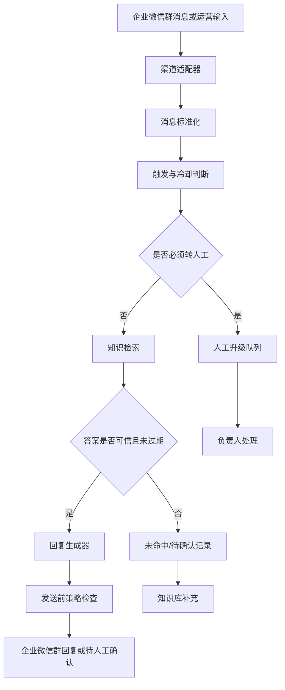

# 技术架构草案

## 目标

第一版要先证明两件事：

1. 基于官方资料能否稳定回答学生高频问题。
2. 在企业微信群场景下，回复、转人工、未命中沉淀是否不会打扰正常沟通。

因此技术上建议先做“可本地验证的问答内核 + 可替换的企业微信适配层”，不要一开始把业务逻辑绑死在某一种企业微信接入方式上。

## 接入方式判断

企业微信群机器人 webhook 通常更适合“向群里发送消息”，例如主动提醒、人工审核后推送 FAQ、每日通知等。它未必等价于“能读取群内学生消息并自动回复”。如果要做真正的群内自动回复，需要在开发前确认企业微信官方支持的接收消息方式，例如自建应用消息回调、群聊机器人能力、会话内容存档或其他合规接口。

因此第一版实现应分两层：

- **问答内核**：独立于企业微信，负责意图识别、知识检索、回答生成、升级判断、冷却去重和日志。
- **渠道适配器**：负责接收企业微信消息、发送群回复、推送人工升级、接收运营确认。

如果接收群消息能力暂时无法确认，仍然可以先交付一个“运营可用版本”：学生问题由运营复制到测试入口或后台，agent 给出建议回复；确认后再通过群机器人 webhook 发到群里。

## 推荐架构



## 核心模块

### 1. 渠道适配器

职责：

- 接收群消息、被 @ 消息或运营手动输入。
- 统一成内部消息格式。
- 调用问答内核。
- 将自动回复、人工升级或待确认结果送回企业微信或运营后台。

第一版建议保留多个实现：

- `manual`：本地命令行或简单网页表单，用于验证 FAQ 和策略。
- `wecom_webhook_outbound`：只负责向群里发主动提醒或人工确认后的消息。
- `wecom_interactive`：等官方接收消息方案确认后再实现。

### 2. 消息标准化

内部消息建议字段：

```yaml
message_id: string
channel: enterprise_wechat | manual
group_id: string
sender_role: student | organizer | mentor | unknown
text: string
mentioned_agent: boolean
created_at: datetime
context_messages: []
```

### 3. 策略引擎

职责：

- 判断是否被 @ 或命中高置信关键词。
- 执行同群同意图冷却规则。
- 在检索前先拦截必须转人工的问题。
- 在发送前检查是否包含未确认承诺、个人状态、过期信息或作业代答倾向。

### 4. 知识检索

第一版可以先用结构化 FAQ，不急着上复杂向量库。每条 FAQ 保留 `stage`、`intent`、`question_aliases`、`answer`、`source`、`source_date`、`valid_until`、`auto_reply` 等字段。

推荐顺序：

1. 精确意图或关键词匹配。
2. 同义问法匹配。
3. 简单语义检索。
4. 低置信时转未命中，不强答。

### 5. 回复生成器

回复必须使用可追溯资料生成，默认结构：

```text
同学你好，[直接答案]

[下一步行动]

[必要边界提示]
```

禁止：

- 编造未发布安排。
- 承诺“已记录”，除非日志系统确认写入成功。
- 查询或暗示个人录取/面试结果。
- 代写作业、给出评分争议结论。

### 6. 人工升级队列

升级记录建议字段：

```yaml
ticket_id: string
original_question: string
group_id: string
created_at: datetime
reason: personal_status | safety | complaint | technical_assignment | stale_source | unknown
urgency: normal | same_day | immediate
suggested_owner: 运营 | 招生负责人 | 课程助教 | 现场保障负责人
candidate_sources: []
status: open | resolved | added_to_kb | ignored
```

## 首版技术路径

### 第一步：本地可验证问答内核

不接企业微信，先把 `seed-faq.md` 转成结构化知识条目，做一个本地问答入口。目标是验证：问 20-30 个学生常见问题时，系统能答的就答，不能答的稳稳拒绝并标记待补充。

### 第二步：运营半自动模式

增加一个人工确认流程：agent 生成建议回复，运营确认后再发到群里。这个阶段可以用企业微信群 webhook 做出站推送，但不假设它能接收群消息。

### 第三步：企业微信互动模式

确认官方接收消息能力后，再实现企业微信互动适配器。所有业务规则仍走同一个问答内核，避免后续换接入方式时重写核心逻辑。

## 待官方确认

- 企业微信群机器人是否支持接收群成员消息或被 @ 事件。
- 自建应用是否能在目标群聊场景中接收学生提问并回复到群。
- 如果使用会话内容存档，是否满足企业合规、授权、费用和隐私要求。
- 群机器人 webhook 的消息类型、频率限制、失败重试和安全签名规则。
- 主动提醒是否需要运营人工确认后发送。

## 微信 FAQ、RAG 与 AI 回复链路

当前微信工作台采用以下固定顺序处理命中触发规则的消息：

1. 必须人工处理的问题优先进入人工队列。
2. FAQ 命中时直接使用已审核答案，不调用外部 AI。
3. FAQ 未命中时检索本地 RAG 文档。
4. 只有高置信且标记为 `official` 的资料才交给 OpenAI 生成自然语言回复。
5. AI 生成内容必须通过依据性、长度和链接检查，才允许自动发送。
6. AI 超时、不可用、配额不足或输出校验失败时，自动降级为对应的官方 RAG 原文。
7. `community` 资料只作为运营参考，未知问题进入待补充队列，两者都不自动发送。

回复日志和工作台详情会记录：

- `generation_mode`：`faq`、`rag_ai`、`rag_fallback`、`rag_community`、`needs_info` 或 `human_fallback`。
- `generation_model`：实际配置的 AI 模型。
- `generation_error`：安全化后的降级原因，例如 `timeout`、`insufficient_quota`、`unsupported_url`。

### OpenAI 配置

服务启动时从环境变量读取配置：

```text
OPENAI_API_KEY=必填
OPENAI_CHAT_MODEL=gpt-5.6-luna
OPENAI_BASE_URL=https://api.openai.com/v1
```

`OPENAI_CHAT_MODEL` 和 `OPENAI_BASE_URL` 可省略，分别使用上面的默认值。API Key 不写入仓库、候选记录或回复日志。

可执行以下命令进行真实 AI、模拟微信收发的闭环验证：

```text
python -m scripts.verify_rag_ai_reply
```

该脚本不会操作真实微信窗口。验证成功时，三个官方 RAG 场景都应显示 `generation_mode=rag_ai` 并完成模拟自动发送；如果 OpenAI 不可用，脚本会失败并报告安全化原因，业务运行时仍会按上述规则降级回复。

